# ML/AI Grading Platform Specification

> **Comprehensive Guide for Machine Learning, Deep Learning, Computer Vision, and Applied AI Challenge Assessment**

**Version:** 1.0  
**Last Updated:** January 5, 2026  
**Status:** Draft Specification

---

## Table of Contents

1. [Executive Summary](#1-executive-summary)
2. [Platform Vision](#2-platform-vision)
3. [Challenge Categories](#3-challenge-categories)
4. [Architecture Overview](#4-architecture-overview)
5. [Grading Modes](#5-grading-modes)
6. [User Flows](#6-user-flows)
7. [Security Model](#7-security-model)
8. [Dataset Management](#8-dataset-management)
9. [Metric Framework](#9-metric-framework)
10. [Anti-Cheating Measures](#10-anti-cheating-measures)
11. [Resource Management](#11-resource-management)
12. [Challenge Lifecycle](#12-challenge-lifecycle)
13. [Applied AI Challenges](#13-applied-ai-challenges)
14. [Integration Points](#14-integration-points)
15. [Deployment Considerations](#15-deployment-considerations)

---

## 1. Executive Summary

### 1.1 Purpose

This specification defines the architecture, security model, and implementation guidelines for extending the exam platform to support **Machine Learning (ML)**, **Deep Learning (DL)**, **Computer Vision (CV)**, and **Applied AI** challenges.

### 1.2 Key Differentiators from Web Development Platform

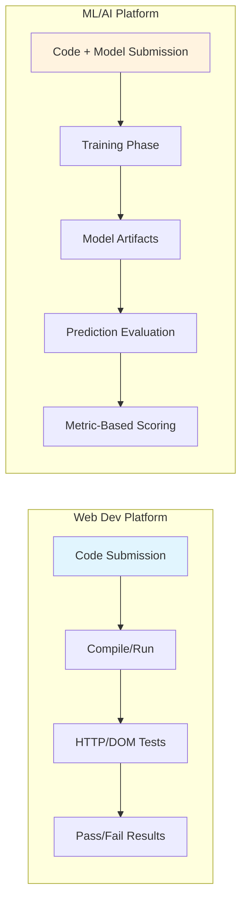
```mermaid
graph LR
    subgraph "Web Dev Platform"
        A[Code Submission] --> B[Compile/Run]
        B --> C[HTTP/DOM Tests]
        C --> D[Pass/Fail Results]
    end
    
    subgraph "ML/AI Platform"
        E[Code + Model Submission] --> F[Training Phase]
        F --> G[Model Artifacts]
        G --> H[Prediction Evaluation]
        H --> I[Metric-Based Scoring]
    end
    
    style A fill:#e1f5fe
    style E fill:#fff3e0
```

| Dimension | Web Development | ML/AI |
|-----------|-----------------|-------|
| **Output** | HTTP responses, UI elements | Model predictions, metrics |
| **Evaluation** | Binary pass/fail | Continuous metric scores |
| **Time Scale** | Seconds | Minutes to hours |
| **Resources** | 512MB RAM, 1 CPU | 4-16GB RAM, GPU optional |
| **Data** | Static fixtures | Large datasets (GB scale) |
| **Determinism** | Fully deterministic | Stochastic (random seeds) |

### 1.3 Scope

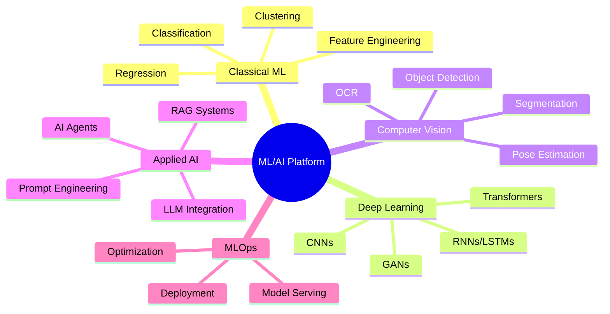
```mermaid
mindmap
  root((ML/AI Platform))
    Classical ML
      Classification
      Regression
      Clustering
      Feature Engineering
    Deep Learning
      CNNs
      RNNs/LSTMs
      Transformers
      GANs
    Computer Vision
      Object Detection
      Segmentation
      Pose Estimation
      OCR
    Applied AI
      LLM Integration
      RAG Systems
      AI Agents
      Prompt Engineering
    MLOps
      Model Serving
      Optimization
      Deployment
```

---

## 2. Platform Vision

### 2.1 Design Principles

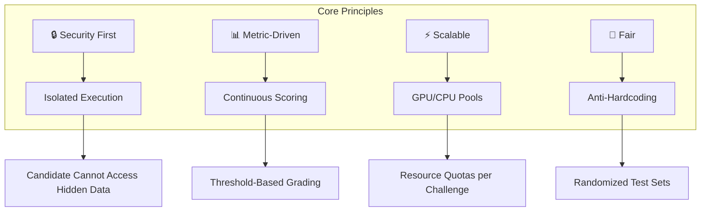
```mermaid
graph TD
    subgraph "Core Principles"
        A[🔒 Security First] --> E[Isolated Execution]
        B[📊 Metric-Driven] --> F[Continuous Scoring]
        C[⚡ Scalable] --> G[GPU/CPU Pools]
        D[🎯 Fair] --> H[Anti-Hardcoding]
    end
    
    E --> I[Candidate Cannot Access Hidden Data]
    F --> J[Threshold-Based Grading]
    G --> K[Resource Quotas per Challenge]
    H --> L[Randomized Test Sets]
```

### 2.2 Stakeholder Requirements

| Stakeholder | Requirements |
|-------------|--------------|
| **Candidates** | Clear problem statements, reasonable time limits, transparent metrics |
| **Examiners** | Easy challenge creation, hidden test isolation, anti-cheat measures |
| **Platform** | Resource efficiency, GPU scheduling, dataset caching |
| **Enterprise** | Audit trails, reproducible evaluations, compliance |

---

## 3. Challenge Categories

### 3.1 Category Taxonomy

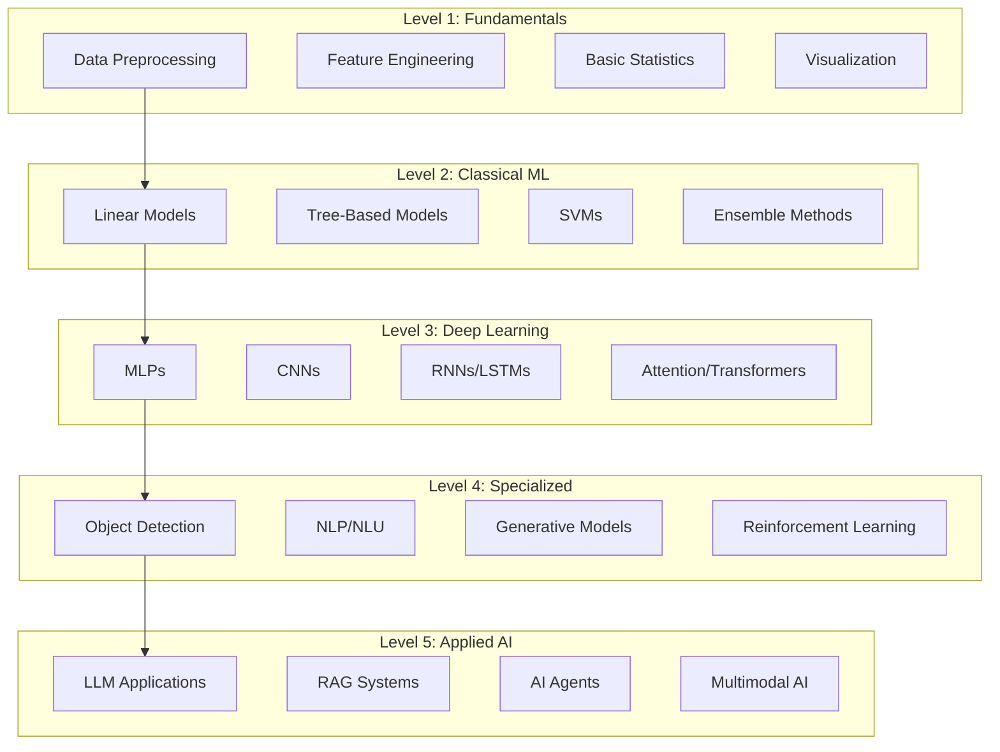
```mermaid
graph TB
    subgraph "Level 1: Fundamentals"
        A1[Data Preprocessing]
        A2[Feature Engineering]
        A3[Basic Statistics]
        A4[Visualization]
    end
    
    subgraph "Level 2: Classical ML"
        B1[Linear Models]
        B2[Tree-Based Models]
        B3[SVMs]
        B4[Ensemble Methods]
    end
    
    subgraph "Level 3: Deep Learning"
        C1[MLPs]
        C2[CNNs]
        C3[RNNs/LSTMs]
        C4[Attention/Transformers]
    end
    
    subgraph "Level 4: Specialized"
        D1[Object Detection]
        D2[NLP/NLU]
        D3[Generative Models]
        D4[Reinforcement Learning]
    end
    
    subgraph "Level 5: Applied AI"
        E1[LLM Applications]
        E2[RAG Systems]
        E3[AI Agents]
        E4[Multimodal AI]
    end
    
    A1 --> B1
    B1 --> C1
    C1 --> D1
    D1 --> E1
```

### 3.2 Challenge Complexity Matrix

| Category | Time Limit | Memory | GPU Required | Dataset Size |
|----------|------------|--------|--------------|--------------|
| **Data Preprocessing** | 5-10 min | 2 GB | No | < 100 MB |
| **Classical ML** | 10-30 min | 4 GB | No | < 500 MB |
| **Deep Learning (Training)** | 30-60 min | 8 GB | Optional | < 2 GB |
| **Computer Vision** | 30-60 min | 16 GB | Recommended | < 5 GB |
| **Applied AI/LLM** | 15-30 min | 8 GB | Optional | API-based |

---

## 4. Architecture Overview

### 4.1 High-Level System Architecture

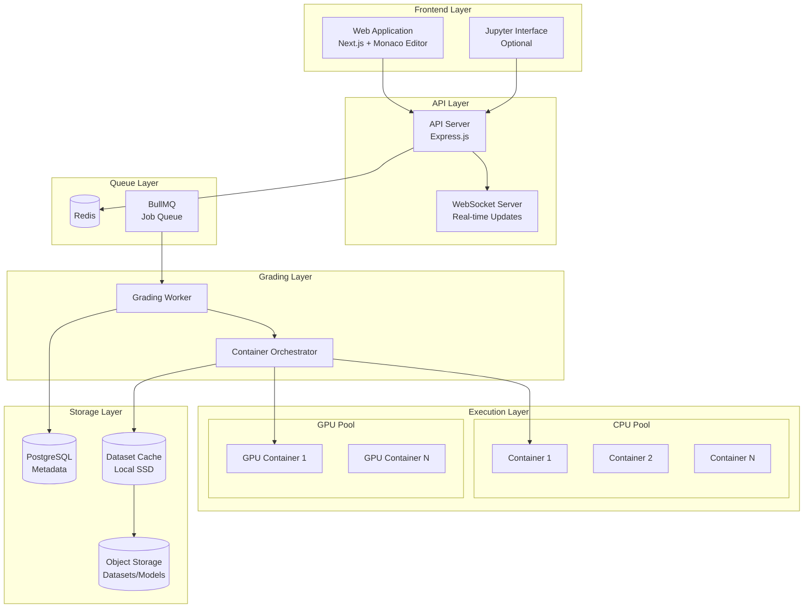
```mermaid
graph TB
    subgraph "Frontend Layer"
        WEB[Web Application<br/>Next.js + Monaco Editor]
        JUPYTER[Jupyter Interface<br/>Optional]
    end
    
    subgraph "API Layer"
        API[API Server<br/>Express.js]
        SOCKET[WebSocket Server<br/>Real-time Updates]
    end
    
    subgraph "Queue Layer"
        REDIS[(Redis)]
        QUEUE[BullMQ<br/>Job Queue]
    end
    
    subgraph "Grading Layer"
        WORKER[Grading Worker]
        ORCHESTRATOR[Container Orchestrator]
    end
    
    subgraph "Execution Layer"
        subgraph "CPU Pool"
            CPU1[Container 1]
            CPU2[Container 2]
            CPU3[Container N]
        end
        subgraph "GPU Pool"
            GPU1[GPU Container 1]
            GPU2[GPU Container N]
        end
    end
    
    subgraph "Storage Layer"
        DB[(PostgreSQL<br/>Metadata)]
        S3[(Object Storage<br/>Datasets/Models)]
        CACHE[(Dataset Cache<br/>Local SSD)]
    end
    
    WEB --> API
    JUPYTER --> API
    API --> REDIS
    API --> SOCKET
    QUEUE --> WORKER
    WORKER --> ORCHESTRATOR
    ORCHESTRATOR --> CPU1
    ORCHESTRATOR --> GPU1
    WORKER --> DB
    ORCHESTRATOR --> CACHE
    CACHE --> S3
```

### 4.2 Grading Worker Architecture

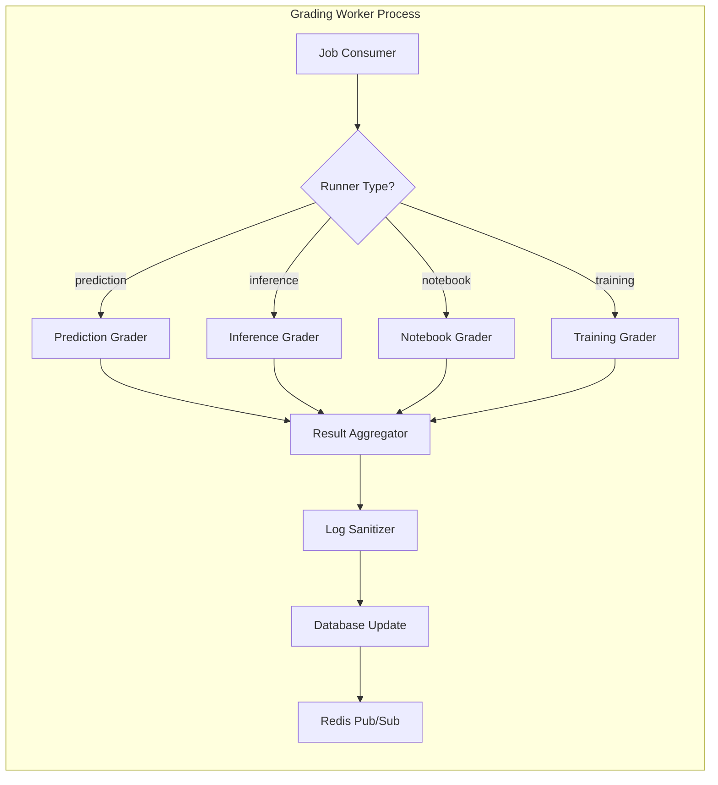
```mermaid
graph LR
    subgraph "Grading Worker Process"
        JOB[Job Consumer] --> ROUTER{Runner Type?}
        
        ROUTER -->|prediction| PRED[Prediction Grader]
        ROUTER -->|inference| INF[Inference Grader]
        ROUTER -->|notebook| NB[Notebook Grader]
        ROUTER -->|training| TRAIN[Training Grader]
        
        PRED --> RESULT[Result Aggregator]
        INF --> RESULT
        NB --> RESULT
        TRAIN --> RESULT
        
        RESULT --> SANITIZE[Log Sanitizer]
        SANITIZE --> STORE[Database Update]
        STORE --> PUBLISH[Redis Pub/Sub]
    end
```

### 4.3 Container Architecture per Challenge

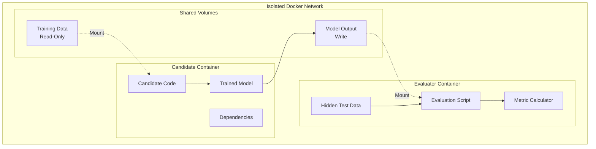
```mermaid
graph TB
    subgraph "Isolated Docker Network"
        subgraph "Candidate Container"
            CODE[Candidate Code]
            MODEL[Trained Model]
            DEPS[Dependencies]
        end
        
        subgraph "Evaluator Container"
            EVAL[Evaluation Script]
            HIDDEN[Hidden Test Data]
            METRICS[Metric Calculator]
        end
        
        subgraph "Shared Volumes"
            TRAIN_DATA[Training Data<br/>Read-Only]
            OUTPUT[Model Output<br/>Write]
        end
    end
    
    CODE --> MODEL
    MODEL --> OUTPUT
    OUTPUT -.->|Mount| EVAL
    HIDDEN --> EVAL
    EVAL --> METRICS
    TRAIN_DATA -.->|Mount| CODE
```

---

## 5. Grading Modes

### 5.1 Mode Comparison


```mermaid
graph TB
    subgraph "Prediction Mode"
        P1[Train Model] --> P2[Save Artifacts]
        P2 --> P3[Load in Evaluator]
        P3 --> P4[Run on Hidden Data]
        P4 --> P5[Compute Metrics]
    end
    
    subgraph "Inference Mode"
        I1[Start Model Server] --> I2[HTTP /predict Endpoint]
        I2 --> I3[Send Test Requests]
        I3 --> I4[Validate Responses]
        I4 --> I5[Measure Latency]
    end
    
    subgraph "Notebook Mode"
        N1[Execute Notebook] --> N2[Extract Tagged Cells]
        N2 --> N3[Validate Outputs]
        N3 --> N4[Check Code Patterns]
        N4 --> N5[Grade Visualizations]
    end
    
    subgraph "Training Mode"
        T1[Provide Dataset] --> T2[Train with Callbacks]
        T2 --> T3[Monitor Loss/Metrics]
        T3 --> T4[Validate Final Model]
        T4 --> T5[Check Generalization]
    end
```

### 5.2 Prediction Mode (Primary)

**Use Case:** Model development challenges where candidates train a model offline and submit prediction code.

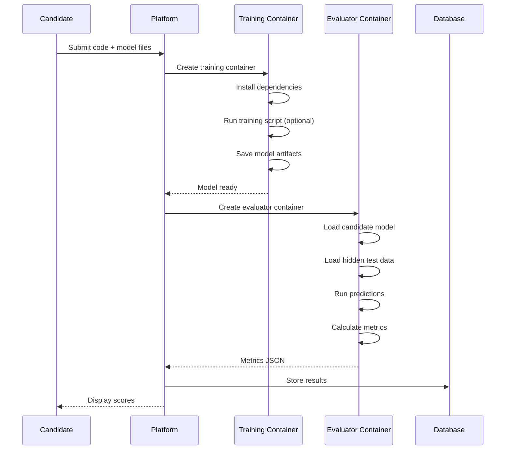
```mermaid
sequenceDiagram
    participant C as Candidate
    participant P as Platform
    participant TC as Training Container
    participant EC as Evaluator Container
    participant DB as Database
    
    C->>P: Submit code + model files
    P->>TC: Create training container
    TC->>TC: Install dependencies
    TC->>TC: Run training script (optional)
    TC->>TC: Save model artifacts
    TC-->>P: Model ready
    
    P->>EC: Create evaluator container
    EC->>EC: Load candidate model
    EC->>EC: Load hidden test data
    EC->>EC: Run predictions
    EC->>EC: Calculate metrics
    EC-->>P: Metrics JSON
    
    P->>DB: Store results
    P-->>C: Display scores
```

### 5.3 Inference Mode

**Use Case:** MLOps challenges where candidates build model serving APIs.

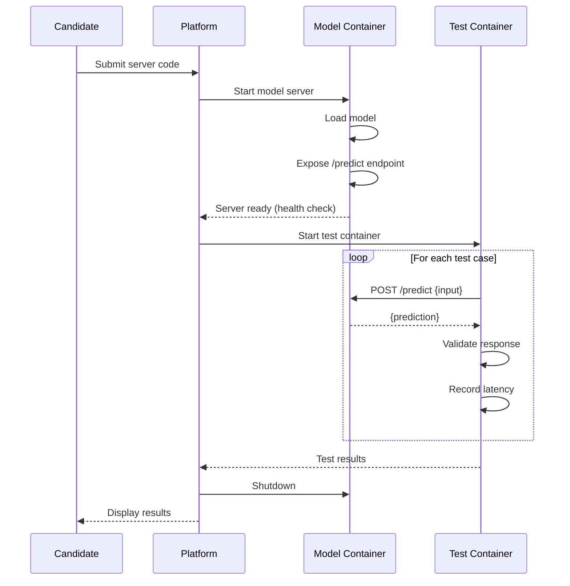
```mermaid
sequenceDiagram
    participant C as Candidate
    participant P as Platform
    participant MC as Model Container
    participant TC as Test Container
    
    C->>P: Submit server code
    P->>MC: Start model server
    MC->>MC: Load model
    MC->>MC: Expose /predict endpoint
    MC-->>P: Server ready (health check)
    
    P->>TC: Start test container
    loop For each test case
        TC->>MC: POST /predict {input}
        MC-->>TC: {prediction}
        TC->>TC: Validate response
        TC->>TC: Record latency
    end
    TC-->>P: Test results
    
    P->>MC: Shutdown
    P-->>C: Display results
```

### 5.4 Notebook Mode

**Use Case:** Data science/EDA challenges with visualization requirements.

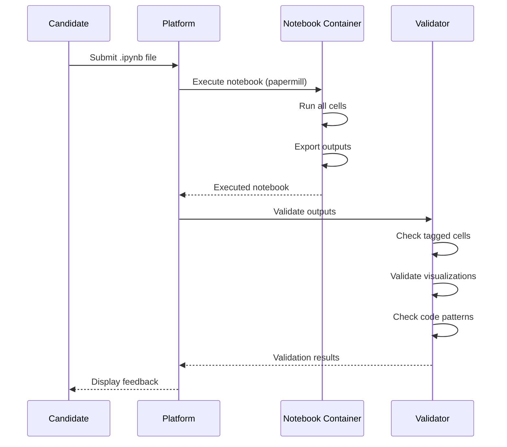
```mermaid
sequenceDiagram
    participant C as Candidate
    participant P as Platform
    participant NC as Notebook Container
    participant V as Validator
    
    C->>P: Submit .ipynb file
    P->>NC: Execute notebook (papermill)
    NC->>NC: Run all cells
    NC->>NC: Export outputs
    NC-->>P: Executed notebook
    
    P->>V: Validate outputs
    V->>V: Check tagged cells
    V->>V: Validate visualizations
    V->>V: Check code patterns
    V-->>P: Validation results
    
    P-->>C: Display feedback
```

---

## 6. User Flows

### 6.1 Candidate Journey

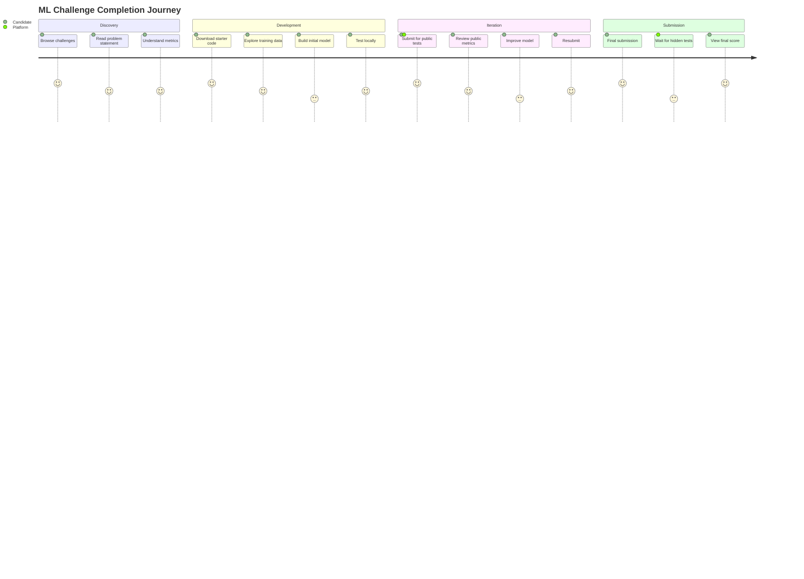
```mermaid
journey
    title ML Challenge Completion Journey
    section Discovery
      Browse challenges: 5: Candidate
      Read problem statement: 4: Candidate
      Understand metrics: 4: Candidate
    section Development
      Download starter code: 5: Candidate
      Explore training data: 4: Candidate
      Build initial model: 3: Candidate
      Test locally: 4: Candidate
    section Iteration
      Submit for public tests: 5: Candidate, Platform
      Review public metrics: 4: Candidate
      Improve model: 3: Candidate
      Resubmit: 4: Candidate
    section Submission
      Final submission: 5: Candidate
      Wait for hidden tests: 3: Platform
      View final score: 5: Candidate
```

### 6.2 Challenge Attempt Flow

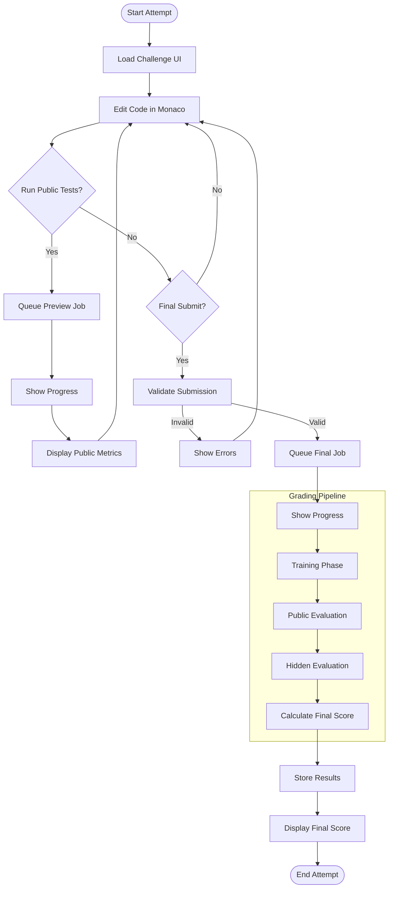
```mermaid
flowchart TD
    START([Start Attempt]) --> LOAD[Load Challenge UI]
    LOAD --> EDIT[Edit Code in Monaco]
    EDIT --> PREVIEW{Run Public Tests?}
    
    PREVIEW -->|Yes| QUEUE1[Queue Preview Job]
    QUEUE1 --> PROGRESS1[Show Progress]
    PROGRESS1 --> RESULT1[Display Public Metrics]
    RESULT1 --> EDIT
    
    PREVIEW -->|No| SUBMIT{Final Submit?}
    SUBMIT -->|No| EDIT
    SUBMIT -->|Yes| VALIDATE[Validate Submission]
    
    VALIDATE -->|Invalid| ERROR[Show Errors]
    ERROR --> EDIT
    
    VALIDATE -->|Valid| QUEUE2[Queue Final Job]
    QUEUE2 --> PROGRESS2[Show Progress]
    
    subgraph "Grading Pipeline"
        PROGRESS2 --> TRAIN[Training Phase]
        TRAIN --> PUBLIC[Public Evaluation]
        PUBLIC --> HIDDEN[Hidden Evaluation]
        HIDDEN --> SCORE[Calculate Final Score]
    end
    
    SCORE --> STORE[Store Results]
    STORE --> DISPLAY[Display Final Score]
    DISPLAY --> END([End Attempt])
```

### 6.3 Real-Time Progress Updates

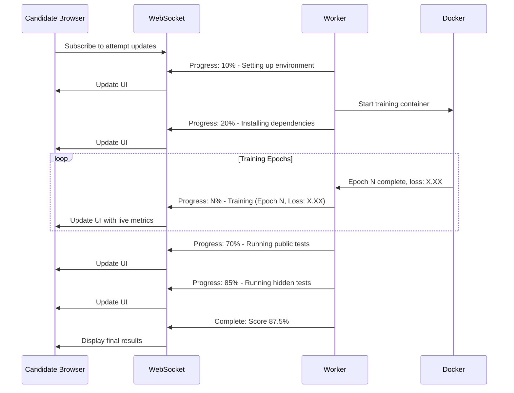
```mermaid
sequenceDiagram
    participant C as Candidate Browser
    participant WS as WebSocket
    participant W as Worker
    participant D as Docker
    
    C->>WS: Subscribe to attempt updates
    
    W->>WS: Progress: 10% - Setting up environment
    WS->>C: Update UI
    
    W->>D: Start training container
    W->>WS: Progress: 20% - Installing dependencies
    WS->>C: Update UI
    
    loop Training Epochs
        D->>W: Epoch N complete, loss: X.XX
        W->>WS: Progress: N% - Training (Epoch N, Loss: X.XX)
        WS->>C: Update UI with live metrics
    end
    
    W->>WS: Progress: 70% - Running public tests
    WS->>C: Update UI
    
    W->>WS: Progress: 85% - Running hidden tests
    WS->>C: Update UI
    
    W->>WS: Complete: Score 87.5%
    WS->>C: Display final results
```

### 6.4 Examiner Challenge Creation Flow

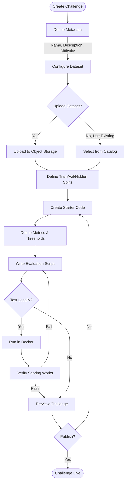
```mermaid
flowchart TD
    START([Create Challenge]) --> META[Define Metadata]
    META --> |Name, Description, Difficulty| DATA[Configure Dataset]
    
    DATA --> UPLOAD{Upload Dataset?}
    UPLOAD -->|Yes| S3[Upload to Object Storage]
    UPLOAD -->|No, Use Existing| SELECT[Select from Catalog]
    
    S3 --> SPLIT[Define Train/Val/Hidden Splits]
    SELECT --> SPLIT
    
    SPLIT --> STARTER[Create Starter Code]
    STARTER --> METRICS[Define Metrics & Thresholds]
    
    METRICS --> EVAL[Write Evaluation Script]
    EVAL --> TEST_LOCAL{Test Locally?}
    
    TEST_LOCAL -->|Yes| DOCKER[Run in Docker]
    DOCKER --> VERIFY[Verify Scoring Works]
    VERIFY -->|Fail| EVAL
    VERIFY -->|Pass| PREVIEW
    
    TEST_LOCAL -->|No| PREVIEW[Preview Challenge]
    PREVIEW --> PUBLISH{Publish?}
    
    PUBLISH -->|No| STARTER
    PUBLISH -->|Yes| LIVE([Challenge Live])
```

---

## 7. Security Model

### 7.1 Threat Model

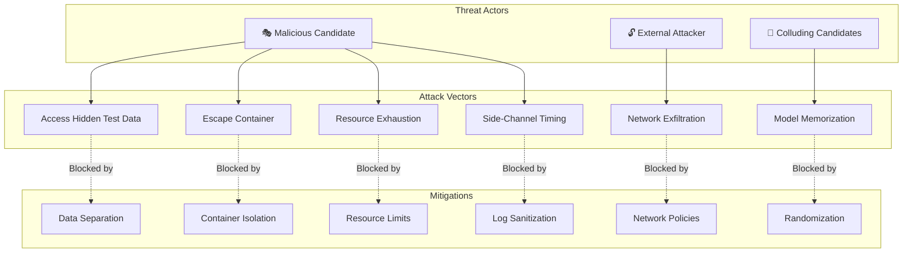
```mermaid
graph TB
    subgraph "Threat Actors"
        T1[🎭 Malicious Candidate]
        T2[🔓 External Attacker]
        T3[👥 Colluding Candidates]
    end
    
    subgraph "Attack Vectors"
        A1[Access Hidden Test Data]
        A2[Escape Container]
        A3[Resource Exhaustion]
        A4[Network Exfiltration]
        A5[Model Memorization]
        A6[Side-Channel Timing]
    end
    
    subgraph "Mitigations"
        M1[Container Isolation]
        M2[Network Policies]
        M3[Resource Limits]
        M4[Data Separation]
        M5[Randomization]
        M6[Log Sanitization]
    end
    
    T1 --> A1
    T1 --> A2
    T1 --> A3
    T2 --> A4
    T3 --> A5
    T1 --> A6
    
    A1 -.->|Blocked by| M4
    A2 -.->|Blocked by| M1
    A3 -.->|Blocked by| M3
    A4 -.->|Blocked by| M2
    A5 -.->|Blocked by| M5
    A6 -.->|Blocked by| M6
```

### 7.2 Defense in Depth

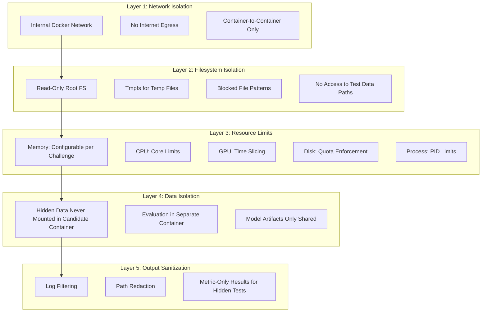
```mermaid
graph TB
    subgraph "Layer 1: Network Isolation"
        N1[Internal Docker Network]
        N2[No Internet Egress]
        N3[Container-to-Container Only]
    end
    
    subgraph "Layer 2: Filesystem Isolation"
        F1[Read-Only Root FS]
        F2[Tmpfs for Temp Files]
        F3[Blocked File Patterns]
        F4[No Access to Test Data Paths]
    end
    
    subgraph "Layer 3: Resource Limits"
        R1[Memory: Configurable per Challenge]
        R2[CPU: Core Limits]
        R3[GPU: Time Slicing]
        R4[Disk: Quota Enforcement]
        R5[Process: PID Limits]
    end
    
    subgraph "Layer 4: Data Isolation"
        D1[Hidden Data Never Mounted in Candidate Container]
        D2[Evaluation in Separate Container]
        D3[Model Artifacts Only Shared]
    end
    
    subgraph "Layer 5: Output Sanitization"
        O1[Log Filtering]
        O2[Path Redaction]
        O3[Metric-Only Results for Hidden Tests]
    end
    
    N1 --> F1
    F1 --> R1
    R1 --> D1
    D1 --> O1
```

### 7.3 Container Security Configuration

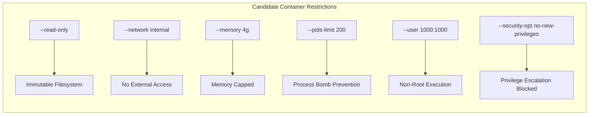
```mermaid
graph LR
    subgraph "Candidate Container Restrictions"
        A[--read-only] --> B[Immutable Filesystem]
        C[--network internal] --> D[No External Access]
        E[--memory 4g] --> F[Memory Capped]
        G[--pids-limit 200] --> H[Process Bomb Prevention]
        I[--user 1000:1000] --> J[Non-Root Execution]
        K[--security-opt no-new-privileges] --> L[Privilege Escalation Blocked]
    end
```

### 7.4 Data Flow Security

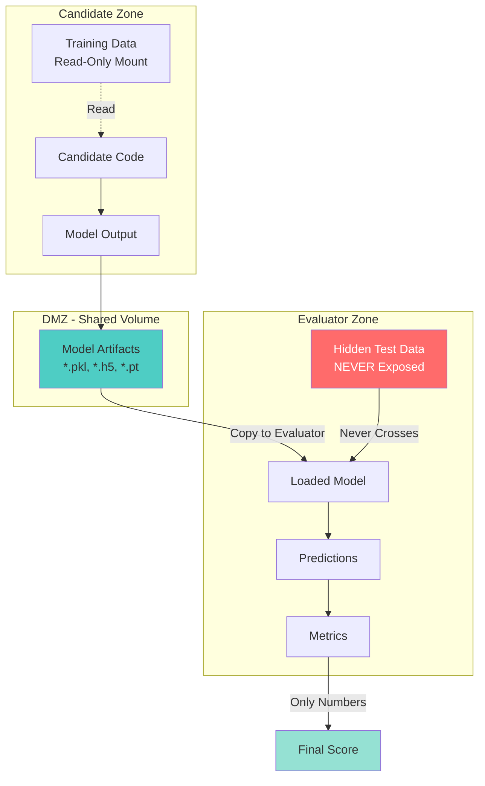
```mermaid
flowchart TD
    subgraph "Candidate Zone"
        C_CODE[Candidate Code]
        C_TRAIN[Training Data<br/>Read-Only Mount]
        C_MODEL[Model Output]
    end
    
    subgraph "DMZ - Shared Volume"
        ARTIFACTS[Model Artifacts<br/>*.pkl, *.h5, *.pt]
    end
    
    subgraph "Evaluator Zone"
        E_HIDDEN[Hidden Test Data<br/>NEVER Exposed]
        E_MODEL[Loaded Model]
        E_PRED[Predictions]
        E_METRICS[Metrics]
    end
    
    C_CODE --> C_MODEL
    C_TRAIN -.->|Read| C_CODE
    C_MODEL --> ARTIFACTS
    
    ARTIFACTS -->|Copy to Evaluator| E_MODEL
    E_HIDDEN -->|Never Crosses| E_MODEL
    E_MODEL --> E_PRED
    E_PRED --> E_METRICS
    
    E_METRICS -->|Only Numbers| RESULT[Final Score]
    
    style E_HIDDEN fill:#ff6b6b,color:#fff
    style ARTIFACTS fill:#4ecdc4
    style RESULT fill:#95e1d3
```

### 7.5 Secret Management

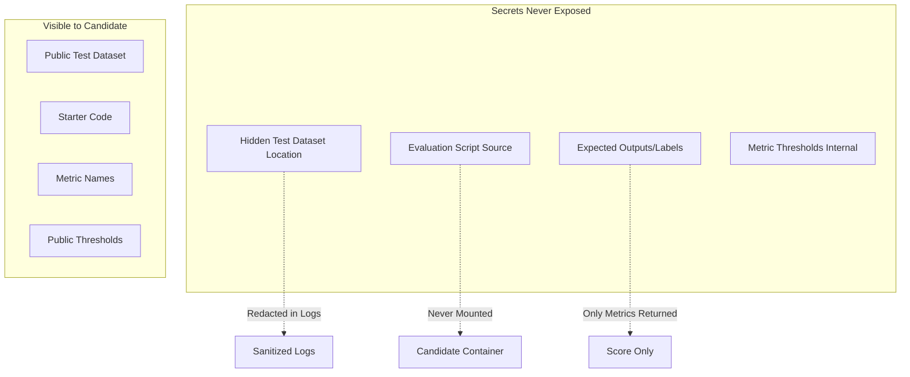
```mermaid
graph TB
    subgraph "Secrets Never Exposed"
        S1[Hidden Test Dataset Location]
        S2[Evaluation Script Source]
        S3[Expected Outputs/Labels]
        S4[Metric Thresholds Internal]
    end
    
    subgraph "Visible to Candidate"
        V1[Public Test Dataset]
        V2[Starter Code]
        V3[Metric Names]
        V4[Public Thresholds]
    end
    
    S1 -.->|Redacted in Logs| LOG[Sanitized Logs]
    S2 -.->|Never Mounted| CONTAINER[Candidate Container]
    S3 -.->|Only Metrics Returned| RESULT[Score Only]
```

---

## 8. Dataset Management

### 8.1 Dataset Lifecycle

```mermaid
stateDiagram-v2
    [*] --> Uploaded: Examiner uploads
    Uploaded --> Validated: Validation checks pass
    Validated --> Split: Define train/val/test splits
    Split --> Cached: Pre-cache on grading nodes
    Cached --> Active: Challenge published
    Active --> Archived: Challenge retired
    Archived --> [*]
    
    Validated --> Rejected: Validation fails
    Rejected --> [*]
```

### 8.2 Dataset Storage Architecture

```mermaid
graph TB
    subgraph "Object Storage (S3/MinIO)"
        RAW[Raw Datasets]
        PROCESSED[Preprocessed Datasets]
        HIDDEN[Hidden Test Sets<br/>Encrypted at Rest]
    end
    
    subgraph "Grading Node"
        SSD[(Local SSD Cache)]
        RAMDISK[(RAM Disk<br/>Hot Data)]
    end
    
    subgraph "Container Mounts"
        TRAIN_MOUNT[/data/train<br/>Read-Only]
        VAL_MOUNT[/data/val<br/>Read-Only]
    end
    
    RAW --> PROCESSED
    PROCESSED --> SSD
    HIDDEN --> SSD
    SSD --> RAMDISK
    RAMDISK --> TRAIN_MOUNT
    RAMDISK --> VAL_MOUNT
```

### 8.3 Dataset Security Levels

| Level | Description | Access | Example |
|-------|-------------|--------|---------|
| **Public** | Fully visible, downloadable | Everyone | MNIST, CIFAR-10 |
| **Training** | Mounted read-only during attempt | Candidate container | Custom training set |
| **Validation** | For public metric calculation | Both containers | 20% holdout |
| **Hidden** | Never exposed, evaluator only | Evaluator container | Final test set |
| **Encrypted** | At-rest encryption required | Evaluator only | Sensitive data |

---

## 9. Metric Framework

### 9.1 Metric Categories

```mermaid
mindmap
  root((Metrics))
    Classification
      Accuracy
      Precision
      Recall
      F1 Score
      AUC-ROC
      AUC-PR
      Log Loss
      Cohen's Kappa
    Regression
      MSE
      RMSE
      MAE
      R² Score
      MAPE
      Explained Variance
    Computer Vision
      IoU
      mAP
      Dice Coefficient
      SSIM
      PSNR
      FID
    NLP
      BLEU
      ROUGE
      Perplexity
      Exact Match
      F1 Token
    Performance
      Inference Latency
      Throughput
      Model Size
      Memory Usage
    Custom
      Domain-Specific
      Weighted Composites
```

### 9.2 Scoring Pipeline

```mermaid
flowchart LR
    PRED[Predictions] --> CALC[Metric Calculator]
    LABELS[Ground Truth] --> CALC
    
    CALC --> RAW[Raw Metrics]
    RAW --> THRESHOLD{Check Thresholds}
    
    THRESHOLD -->|Pass All| FULL[Full Score]
    THRESHOLD -->|Partial| PARTIAL[Proportional Score]
    THRESHOLD -->|Fail All| ZERO[Zero Score]
    
    FULL --> WEIGHT[Apply Weights]
    PARTIAL --> WEIGHT
    ZERO --> WEIGHT
    
    WEIGHT --> FINAL[Final Score]
```

### 9.3 Threshold-Based Grading

```mermaid
graph TB
    subgraph "Metric: Accuracy"
        T1[">= 95%"] -->|10 points| S1[Excellent]
        T2[">= 85%"] -->|8 points| S2[Good]
        T3[">= 75%"] -->|6 points| S3[Passing]
        T4["< 75%"] -->|0 points| S4[Fail]
    end
    
    subgraph "Metric: Inference Time"
        L1["< 50ms"] -->|5 points| P1[Optimal]
        L2["< 100ms"] -->|3 points| P2[Acceptable]
        L3[">= 100ms"] -->|0 points| P3[Too Slow]
    end
    
    S1 --> TOTAL[Total Score]
    S2 --> TOTAL
    S3 --> TOTAL
    P1 --> TOTAL
    P2 --> TOTAL
```

### 9.4 Multi-Metric Aggregation

```mermaid
flowchart TD
    subgraph "Individual Metrics"
        M1[Accuracy: 0.87]
        M2[F1 Score: 0.82]
        M3[Latency: 45ms]
    end
    
    subgraph "Weights"
        W1[Weight: 0.4]
        W2[Weight: 0.4]
        W3[Weight: 0.2]
    end
    
    M1 --> |x 0.4| C1[0.348]
    M2 --> |x 0.4| C2[0.328]
    M3 --> |Normalized, x 0.2| C3[0.18]
    
    C1 --> SUM[Sum: 0.856]
    C2 --> SUM
    C3 --> SUM
    
    SUM --> SCALE[Scale to 100]
    SCALE --> FINAL[Final: 85.6/100]
```

---

## 10. Anti-Cheating Measures

### 10.1 Anti-Hardcoding Strategy

```mermaid
graph TB
    subgraph "Problem: Hardcoding"
        H1[Candidate memorizes public test answers]
        H2[Returns fixed outputs regardless of input]
        H3[Passes public tests, fails hidden]
    end
    
    subgraph "Solution: Randomization"
        R1[Hidden test uses different data samples]
        R2[Random seeds vary per attempt]
        R3[Data augmentation in hidden tests]
        R4[Different class distributions]
    end
    
    subgraph "Detection"
        D1[Compare public vs hidden scores]
        D2[Flag large discrepancies]
        D3[Check prediction variance]
    end
    
    H1 -.->|Prevented by| R1
    H2 -.->|Detected by| D3
    H3 -.->|Caught by| D1
```

### 10.2 Model Validation Checks

```mermaid
flowchart TD
    MODEL[Submitted Model] --> CHECK1{File Size<br/>Reasonable?}
    CHECK1 -->|No| REJECT1[Reject: Oversized]
    CHECK1 -->|Yes| CHECK2{Loads<br/>Successfully?}
    
    CHECK2 -->|No| REJECT2[Reject: Corrupt]
    CHECK2 -->|Yes| CHECK3{Accepts<br/>Valid Input?}
    
    CHECK3 -->|No| REJECT3[Reject: API Mismatch]
    CHECK3 -->|Yes| CHECK4{Output Shape<br/>Correct?}
    
    CHECK4 -->|No| REJECT4[Reject: Wrong Output]
    CHECK4 -->|Yes| CHECK5{Not Constant<br/>Output?}
    
    CHECK5 -->|No| FLAG1[Flag: Possible Hardcoding]
    CHECK5 -->|Yes| EVALUATE[Proceed to Evaluation]
```

### 10.3 Plagiarism Detection

```mermaid
graph LR
    subgraph "Submission Analysis"
        A1[Code Structure]
        A2[Model Architecture]
        A3[Hyperparameters]
        A4[Variable Names]
    end
    
    subgraph "Comparison"
        B1[Cross-Submission Similarity]
        B2[Known Solution Database]
        B3[Internet Code Matching]
    end
    
    subgraph "Flags"
        C1[High Similarity Score]
        C2[Unusual Patterns]
        C3[Identical Errors]
    end
    
    A1 --> B1
    A2 --> B1
    A3 --> B2
    A4 --> B3
    
    B1 --> C1
    B2 --> C2
    B3 --> C3
```

### 10.4 Proctoring Integration

```mermaid
sequenceDiagram
    participant C as Candidate
    participant P as Proctor System
    participant E as Exam Platform
    
    C->>E: Start Attempt
    E->>P: Begin Monitoring
    
    loop During Attempt
        P->>P: Monitor Tab Switches
        P->>P: Detect Focus Loss
        P->>P: Track Clipboard Activity
        
        alt Suspicious Activity
            P->>E: Log Event
            E->>E: Increment Violation Count
        end
    end
    
    C->>E: Submit
    E->>P: End Monitoring
    P->>E: Send Activity Log
    E->>E: Store with Submission
```

---

## 11. Resource Management

### 11.1 Resource Allocation Strategy

```mermaid
graph TB
    subgraph "Resource Pools"
        CPU_POOL[CPU Worker Pool<br/>Standard ML Tasks]
        GPU_POOL[GPU Worker Pool<br/>Deep Learning Tasks]
        PRIORITY_POOL[Priority Pool<br/>Final Submissions]
    end
    
    subgraph "Job Classification"
        PREVIEW[Preview Jobs<br/>Low Priority]
        STANDARD[Standard Jobs<br/>Medium Priority]
        FINAL[Final Submission<br/>High Priority]
    end
    
    PREVIEW --> CPU_POOL
    STANDARD --> CPU_POOL
    STANDARD --> GPU_POOL
    FINAL --> PRIORITY_POOL
    FINAL --> GPU_POOL
```

### 11.2 GPU Scheduling

```mermaid
gantt
    title GPU Resource Timeline
    dateFormat  HH:mm
    axisFormat %H:%M
    
    section GPU 0
    Job A (Training)    :a1, 00:00, 15m
    Job D (Inference)   :a2, after a1, 5m
    Job G (Training)    :a3, after a2, 20m
    
    section GPU 1
    Job B (Training)    :b1, 00:00, 20m
    Job E (Training)    :b2, after b1, 15m
    
    section GPU 2
    Job C (Inference)   :c1, 00:00, 5m
    Job F (Training)    :c2, after c1, 25m
    Idle                :c3, after c2, 10m
```

### 11.3 Memory Management

```mermaid
graph TD
    subgraph "Container Memory Lifecycle"
        ALLOC[Allocate Memory Limit] --> LOAD[Load Model/Data]
        LOAD --> TRAIN[Training/Inference]
        TRAIN --> PEAK{Peak Usage?}
        
        PEAK -->|< Limit| CONTINUE[Continue]
        PEAK -->|>= Limit| OOM[OOM Killer]
        
        CONTINUE --> CLEANUP[Cleanup]
        OOM --> FAIL[Job Failed]
        
        CLEANUP --> RELEASE[Release Memory]
    end
```

### 11.4 Timeout Handling

```mermaid
stateDiagram-v2
    [*] --> Running: Job Starts
    Running --> Warning: 80% Time Elapsed
    Warning --> Running: Continue
    Warning --> Timeout: 100% Time
    Running --> Complete: Finished Early
    Running --> Timeout: Time Exceeded
    
    Timeout --> Checkpoint: Save Progress?
    Checkpoint --> PartialScore: Calculate Partial
    Timeout --> ZeroScore: No Checkpoint
    
    Complete --> FullScore: Full Evaluation
    PartialScore --> [*]
    ZeroScore --> [*]
    FullScore --> [*]
```

---

## 12. Challenge Lifecycle

### 12.1 Challenge States

```mermaid
stateDiagram-v2
    [*] --> Draft: Create
    Draft --> Review: Submit for Review
    Review --> Draft: Needs Changes
    Review --> Approved: Passes Review
    Approved --> Scheduled: Set Live Date
    Scheduled --> Active: Publish
    Active --> Paused: Temporary Disable
    Paused --> Active: Re-enable
    Active --> Archived: End Date Reached
    Archived --> [*]
```

### 12.2 Challenge Versioning

```mermaid
graph LR
    subgraph "Version Control"
        V1[v1.0.0<br/>Initial Release]
        V1.1[v1.1.0<br/>Bug Fix]
        V1.2[v1.2.0<br/>New Metric]
        V2[v2.0.0<br/>Major Update]
    end
    
    V1 --> V1.1
    V1.1 --> V1.2
    V1.2 --> V2
    
    subgraph "Attempt Binding"
        A1[Attempt 1] -.-> V1
        A2[Attempt 2] -.-> V1.1
        A3[Attempt 3] -.-> V2
    end
```

### 12.3 Quality Assurance Flow

```mermaid
flowchart TD
    CREATE[Create Challenge] --> SELF_TEST[Self-Test by Author]
    SELF_TEST --> PEER[Peer Review]
    
    PEER --> CHECK1{Dataset Valid?}
    CHECK1 -->|No| FIX1[Fix Dataset]
    FIX1 --> PEER
    
    CHECK1 -->|Yes| CHECK2{Metrics Working?}
    CHECK2 -->|No| FIX2[Fix Evaluation]
    FIX2 --> PEER
    
    CHECK2 -->|Yes| CHECK3{Edge Cases Handled?}
    CHECK3 -->|No| FIX3[Add Edge Cases]
    FIX3 --> PEER
    
    CHECK3 -->|Yes| PILOT[Pilot with Beta Users]
    PILOT --> FEEDBACK{Issues Found?}
    
    FEEDBACK -->|Yes| ITERATE[Iterate]
    ITERATE --> PEER
    
    FEEDBACK -->|No| APPROVE[Approve for Production]
    APPROVE --> PUBLISH[Publish]
```

---

## 13. Applied AI Challenges

### 13.1 LLM Integration Architecture

```mermaid
graph TB
    subgraph "Candidate Environment"
        CODE[Candidate Code]
        PROMPT[Prompt Templates]
        CHAIN[LangChain/LlamaIndex]
    end
    
    subgraph "API Gateway"
        PROXY[LLM Proxy Service]
        QUOTA[Token Quota Manager]
        CACHE[Response Cache]
    end
    
    subgraph "LLM Providers"
        OPENAI[OpenAI API]
        LOCAL[Local LLM<br/>Ollama/vLLM]
        MOCK[Mock LLM<br/>For Testing]
    end
    
    CODE --> CHAIN
    CHAIN --> PROXY
    PROXY --> QUOTA
    QUOTA --> CACHE
    CACHE --> OPENAI
    CACHE --> LOCAL
    CACHE --> MOCK
```

### 13.2 RAG System Evaluation

```mermaid
flowchart TD
    subgraph "Candidate Submission"
        EMBED[Embedding Model]
        VECTOR[Vector Store Setup]
        RETRIEVE[Retrieval Logic]
        GENERATE[Generation Pipeline]
    end
    
    subgraph "Evaluation Dimensions"
        E1[Retrieval Quality<br/>Precision@K, Recall@K]
        E2[Answer Quality<br/>ROUGE, BERTScore]
        E3[Faithfulness<br/>Hallucination Detection]
        E4[Latency<br/>E2E Response Time]
    end
    
    EMBED --> E1
    RETRIEVE --> E1
    GENERATE --> E2
    GENERATE --> E3
    GENERATE --> E4
```

### 13.3 AI Agent Evaluation

```mermaid
sequenceDiagram
    participant E as Evaluator
    participant A as Agent
    participant T as Tool/Environment
    
    E->>A: Task: "Find and summarize top 3 papers on X"
    
    loop Agent Reasoning
        A->>A: Think: What tools do I need?
        A->>T: Action: Search("X research papers")
        T-->>A: Results: [paper1, paper2, ...]
        A->>A: Think: Process results
        A->>T: Action: Read(paper1.url)
        T-->>A: Content: "..."
    end
    
    A->>E: Final Answer: "Summary..."
    
    E->>E: Evaluate:
    Note over E: - Task Completion Rate<br/>- Tool Usage Efficiency<br/>- Reasoning Quality<br/>- Answer Correctness
```

### 13.4 Prompt Engineering Challenges

```mermaid
graph TB
    subgraph "Challenge Types"
        P1[Zero-Shot Prompting]
        P2[Few-Shot Prompting]
        P3[Chain-of-Thought]
        P4[Prompt Injection Defense]
        P5[Output Formatting]
    end
    
    subgraph "Evaluation Criteria"
        E1[Task Success Rate]
        E2[Token Efficiency]
        E3[Robustness to Variations]
        E4[Format Compliance]
    end
    
    P1 --> E1
    P2 --> E1
    P2 --> E2
    P3 --> E1
    P4 --> E3
    P5 --> E4
```

### 13.5 Applied AI Security Considerations

```mermaid
graph TB
    subgraph "Threats"
        T1[Prompt Injection via Test Data]
        T2[API Key Extraction Attempts]
        T3[Excessive Token Usage]
        T4[Jailbreak Attempts]
    end
    
    subgraph "Mitigations"
        M1[Prompt Sanitization]
        M2[Key Never in Container]
        M3[Token Quotas per Attempt]
        M4[Output Filtering]
    end
    
    T1 -.->|Blocked by| M1
    T2 -.->|Blocked by| M2
    T3 -.->|Blocked by| M3
    T4 -.->|Blocked by| M4
```

---

## 14. Integration Points

### 14.1 System Integration Map

```mermaid
graph TB
    subgraph "Core Platform"
        API[API Server]
        WORKER[Grading Worker]
        DB[(Database)]
    end
    
    subgraph "ML Infrastructure"
        DOCKER[Docker/Kubernetes]
        GPU[GPU Scheduler]
        STORAGE[Object Storage]
    end
    
    subgraph "External Services"
        LLM[LLM APIs]
        MONITOR[Monitoring]
        NOTIFY[Notifications]
    end
    
    subgraph "Data Pipeline"
        ETL[Dataset Pipeline]
        CACHE[Cache Layer]
    end
    
    API <--> WORKER
    WORKER <--> DOCKER
    WORKER <--> GPU
    DOCKER <--> STORAGE
    WORKER <--> LLM
    WORKER --> MONITOR
    API --> NOTIFY
    ETL --> STORAGE
    STORAGE --> CACHE
    CACHE --> DOCKER
```

### 14.2 API Endpoints for ML Challenges

```mermaid
graph LR
    subgraph "Challenge Management"
        A1[POST /challenges<br/>Create ML Challenge]
        A2[PUT /challenges/:id/dataset<br/>Upload Dataset]
        A3[POST /challenges/:id/validate<br/>Validate Setup]
    end
    
    subgraph "Attempt Operations"
        B1[POST /attempts/:id/train<br/>Trigger Training]
        B2[POST /attempts/:id/evaluate<br/>Run Evaluation]
        B3[GET /attempts/:id/metrics<br/>Get Metrics]
        B4[GET /attempts/:id/logs<br/>Stream Logs]
    end
    
    subgraph "Resource Management"
        C1[GET /resources/gpu<br/>GPU Availability]
        C2[POST /resources/quota<br/>Request Resources]
    end
```

### 14.3 Event Flow

```mermaid
sequenceDiagram
    participant C as Client
    participant A as API
    participant Q as Queue
    participant W as Worker
    participant M as Metrics
    participant N as Notify
    
    C->>A: Submit ML Challenge
    A->>Q: Enqueue Job
    A-->>C: Job ID
    
    Q->>W: Dequeue Job
    W->>W: Execute Training
    W->>M: Record Metrics
    W->>Q: Job Complete
    
    Q->>A: Result Ready
    A->>N: Send Notification
    N-->>C: Push Notification
    C->>A: Fetch Results
    A-->>C: Metrics + Score
```

---

## 15. Deployment Considerations

### 15.1 Infrastructure Requirements

```mermaid
graph TB
    subgraph "Minimum Production Setup"
        LB[Load Balancer]
        
        subgraph "API Tier"
            API1[API Server 1]
            API2[API Server 2]
        end
        
        subgraph "Worker Tier"
            CPU1[CPU Worker 1<br/>8 cores, 32GB]
            CPU2[CPU Worker 2<br/>8 cores, 32GB]
            GPU1[GPU Worker 1<br/>NVIDIA T4, 16GB]
        end
        
        subgraph "Data Tier"
            PG[(PostgreSQL<br/>Primary)]
            PG_R[(PostgreSQL<br/>Replica)]
            REDIS[(Redis Cluster)]
            S3[(Object Storage<br/>Datasets)]
        end
    end
    
    LB --> API1
    LB --> API2
    API1 --> REDIS
    API2 --> REDIS
    REDIS --> CPU1
    REDIS --> CPU2
    REDIS --> GPU1
    API1 --> PG
    PG --> PG_R
    CPU1 --> S3
    GPU1 --> S3
```

### 15.2 Scaling Strategy

```mermaid
graph LR
    subgraph "Horizontal Scaling"
        A[API Servers] --> |Auto-scale| A2[More API Pods]
        W[CPU Workers] --> |Auto-scale| W2[More Workers]
    end
    
    subgraph "Vertical Scaling"
        G[GPU Workers] --> |Upgrade| G2[Better GPUs]
        M[Memory] --> |Increase| M2[More RAM per Worker]
    end
    
    subgraph "Triggers"
        T1[Queue Depth > 100]
        T2[Avg Wait Time > 5min]
        T3[GPU Utilization > 80%]
    end
    
    T1 --> A
    T1 --> W
    T2 --> W
    T3 --> G
```

### 15.3 Monitoring & Observability

```mermaid
graph TB
    subgraph "Metrics Collection"
        M1[Job Duration]
        M2[Queue Depth]
        M3[GPU Utilization]
        M4[Memory Usage]
        M5[Success Rate]
    end
    
    subgraph "Alerting Rules"
        A1[Job Failed Rate > 10%]
        A2[Queue Wait > 10min]
        A3[GPU OOM Errors]
        A4[Worker Down]
    end
    
    subgraph "Dashboards"
        D1[Real-time Job Status]
        D2[Resource Utilization]
        D3[Challenge Analytics]
        D4[Error Tracking]
    end
    
    M1 --> D1
    M2 --> D1
    M3 --> D2
    M4 --> D2
    M5 --> D3
    
    M5 --> A1
    M2 --> A2
    M4 --> A3
```

### 15.4 Disaster Recovery

```mermaid
flowchart TD
    subgraph "Backup Strategy"
        B1[Database: Daily Snapshots]
        B2[Datasets: Cross-Region Replication]
        B3[Models: Versioned in Object Storage]
        B4[Configs: GitOps Repository]
    end
    
    subgraph "Recovery Procedures"
        R1[Database Restore < 1 hour]
        R2[Worker Rebuild < 30 min]
        R3[Full Platform Recovery < 4 hours]
    end
    
    subgraph "Failover"
        F1[Primary Region] -->|Failure| F2[Secondary Region]
        F2 -->|DNS Failover| F3[Traffic Rerouted]
    end
```

---

## Appendix A: Challenge Template Quick Reference

### A.1 Classification Challenge

```yaml
name: "Image Classification"
type: classification
metrics:
  - accuracy (threshold: 0.85)
  - f1_macro (threshold: 0.80)
resources:
  memory: 4GB
  gpu: optional
  timeout: 30min
datasets:
  train: "s3://datasets/imagenet-mini/train"
  hidden: "s3://datasets/imagenet-mini/test"
```

### A.2 Regression Challenge

```yaml
name: "Housing Price Prediction"
type: regression
metrics:
  - rmse (lower is better, threshold: 50000)
  - r2 (threshold: 0.85)
resources:
  memory: 2GB
  gpu: no
  timeout: 15min
```

### A.3 Object Detection Challenge

```yaml
name: "Vehicle Detection"
type: object_detection
metrics:
  - mAP@0.5 (threshold: 0.70)
  - mAP@0.5:0.95 (threshold: 0.50)
resources:
  memory: 8GB
  gpu: required
  timeout: 60min
```

### A.4 LLM Application Challenge

```yaml
name: "Document QA System"
type: rag
metrics:
  - retrieval_precision@5 (threshold: 0.80)
  - answer_rouge_l (threshold: 0.70)
  - faithfulness (threshold: 0.90)
resources:
  memory: 4GB
  llm_tokens: 10000
  timeout: 20min
```

---

## Appendix B: Glossary

| Term | Definition |
|------|------------|
| **Hidden Test Set** | Data used for final scoring, never exposed to candidates |
| **Metric Threshold** | Minimum score required to earn points |
| **Prediction Mode** | Grading mode where model artifacts are evaluated |
| **Inference Mode** | Grading mode for model serving API challenges |
| **RAG** | Retrieval-Augmented Generation |
| **mAP** | Mean Average Precision (object detection metric) |
| **IoU** | Intersection over Union (segmentation metric) |
| **Token Quota** | Limited API tokens for LLM challenges |

---

## Appendix C: Revision History

| Version | Date | Author | Changes |
|---------|------|--------|---------|
| 1.0.0 | 2026-01-05 | Platform Team | Initial specification |

---

*End of Specification*

