# LLM Integration Architecture

> **How the platform integrates with Large Language Model APIs for Applied AI challenges**

---

## Table of Contents

1. [Overview](#1-overview)
2. [System Architecture](#2-system-architecture)
3. [LLM Proxy Service](#3-llm-proxy-service)
4. [Supported Providers](#4-supported-providers)
5. [Security Model](#5-security-model)
6. [Request/Response Flow](#6-requestresponse-flow)
7. [Error Handling](#7-error-handling)
8. [Testing Infrastructure](#8-testing-infrastructure)
9. [Challenge Examples](#9-challenge-examples)

---

## 1. Overview

### Why a Proxy Architecture?

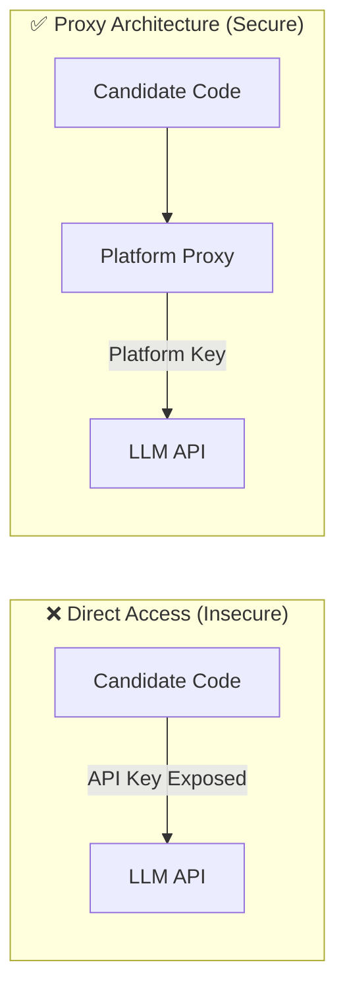

**Benefits:**
- 🔒 API keys never exposed to candidates
- 📊 Centralized usage tracking
- 💰 Cost control via quotas
- 🚀 Response caching for efficiency
- 🔍 Request/response logging for debugging

---

## 2. System Architecture

### High-Level Flow

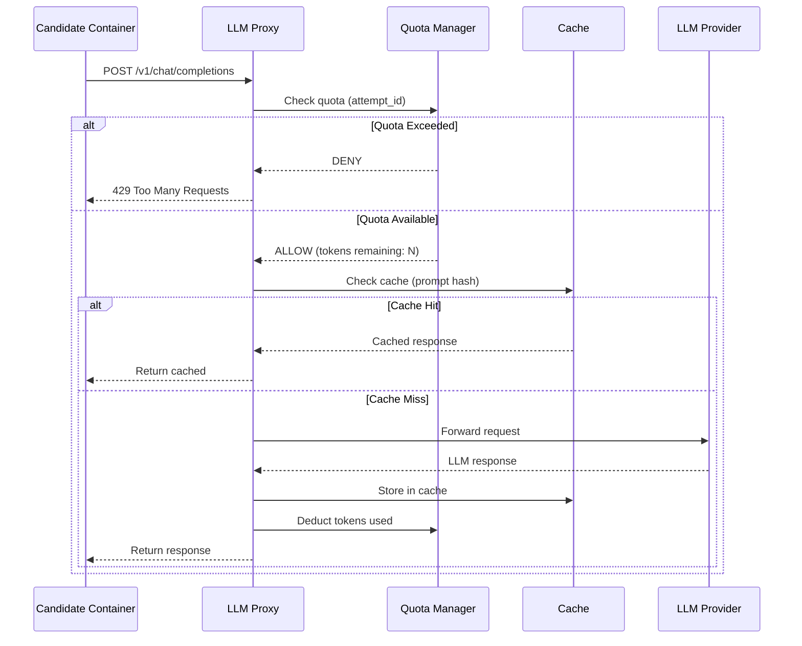

### Component Diagram

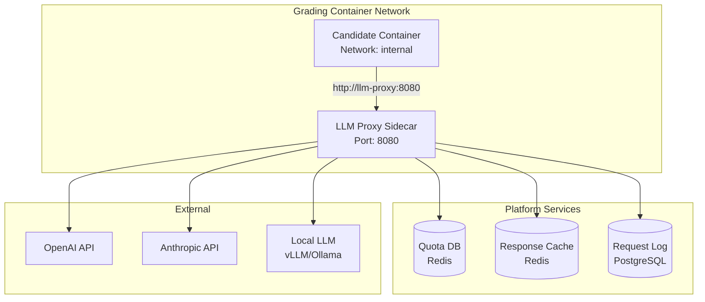

---

## 3. LLM Proxy Service

### Endpoint Compatibility

The proxy mimics OpenAI's API format for universal compatibility:

| Endpoint | Description |
|----------|-------------|
| `POST /v1/chat/completions` | Chat completions (GPT-4, Claude, etc.) |
| `POST /v1/completions` | Legacy completions |
| `POST /v1/embeddings` | Text embeddings |
| `GET /v1/models` | List available models |

### Request Transformation

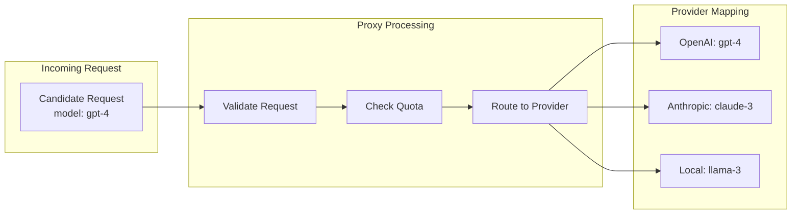

### Environment Variables for Candidates

Candidates access the LLM through these environment variables:

```bash
# Set by platform automatically
OPENAI_API_KEY="proxy-token-xxxxx"  # Not a real key, proxy auth token
OPENAI_BASE_URL="http://llm-proxy:8080/v1"

# Or for direct use
LLM_PROXY_URL="http://llm-proxy:8080"
LLM_ATTEMPT_ID="attempt-uuid"
```

---

## 4. Supported Providers

### Provider Matrix

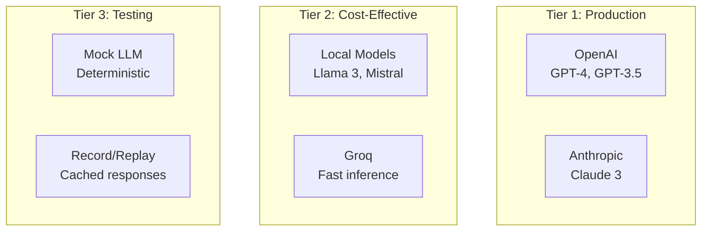

### Model Mapping

| Challenge Requests | Actual Provider | Use Case |
|-------------------|-----------------|----------|
| `gpt-4` | OpenAI GPT-4 | Premium challenges |
| `gpt-3.5-turbo` | OpenAI or Local | Standard challenges |
| `claude-3-sonnet` | Anthropic | Alternative provider |
| `llama-3-70b` | Local vLLM | Cost-sensitive |
| `mock-deterministic` | Mock Service | Testing |

---

## 5. Security Model

### Defense Layers

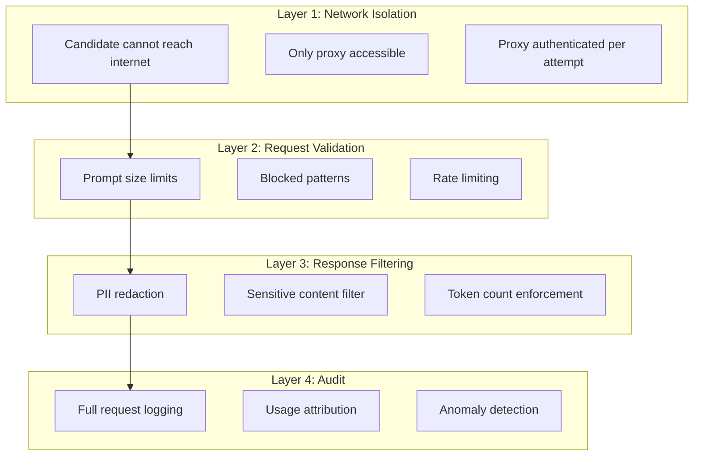

### Prompt Injection Defense

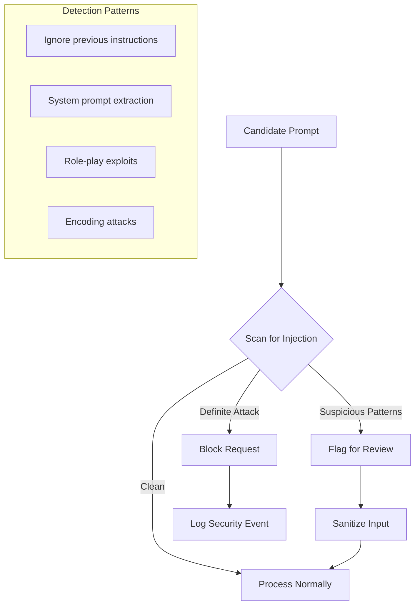

### API Key Protection

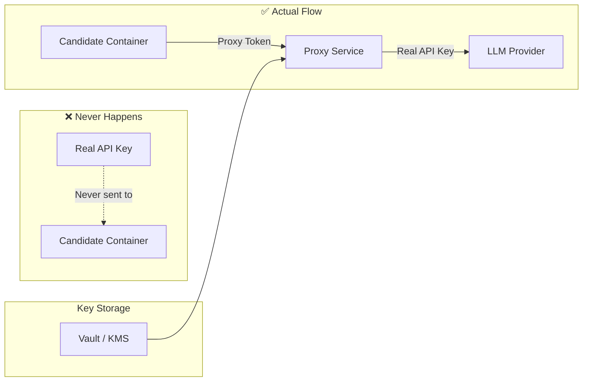

---

## 6. Request/Response Flow

### Detailed Sequence

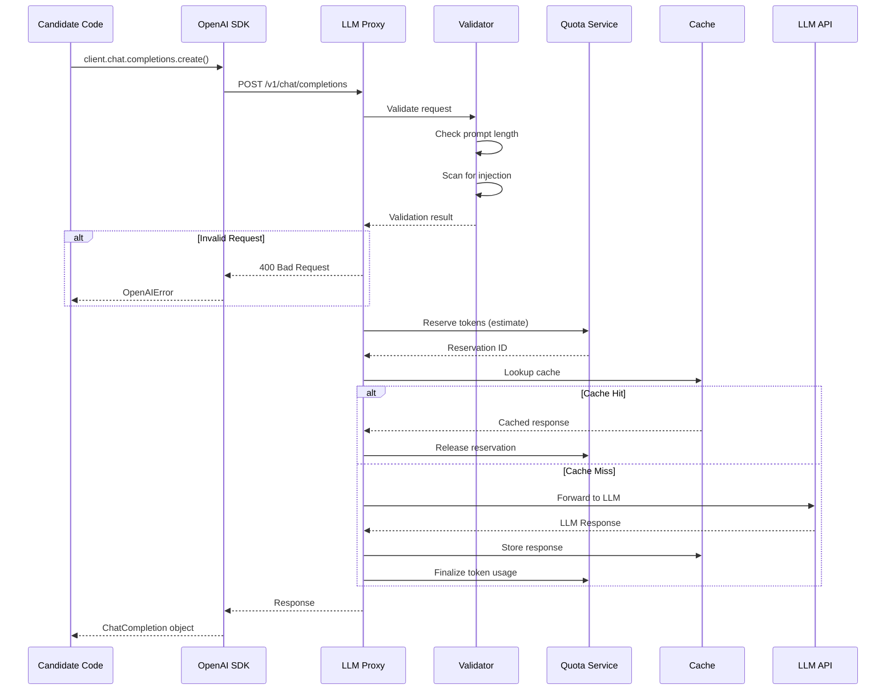

### Request Logging

Every request is logged with:

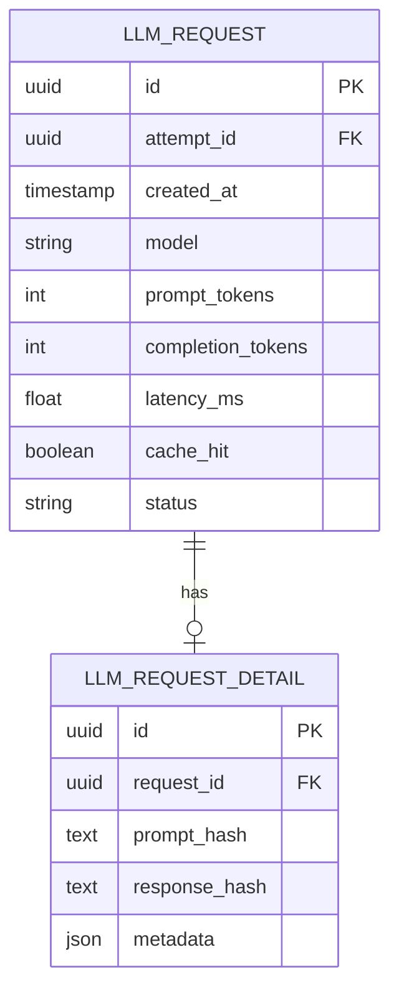

---

## 7. Error Handling

### Error Categories

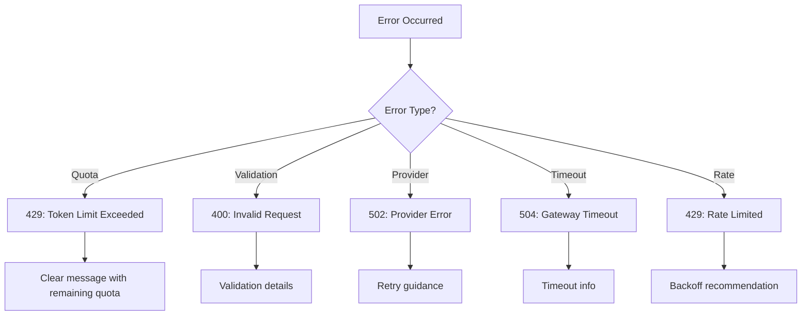

### Retry Strategy

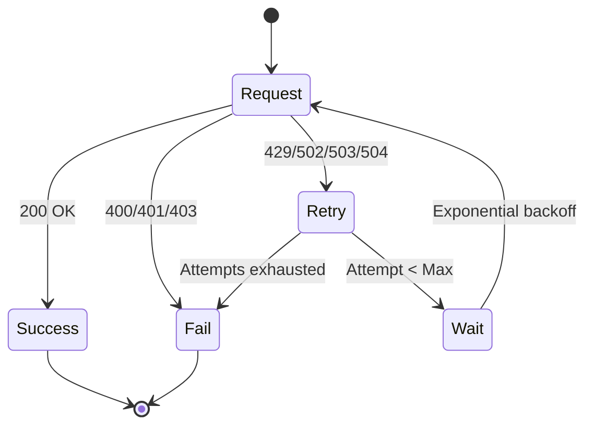

---

## 8. Testing Infrastructure

### Mock LLM Service

For development and testing, a deterministic mock LLM is available:

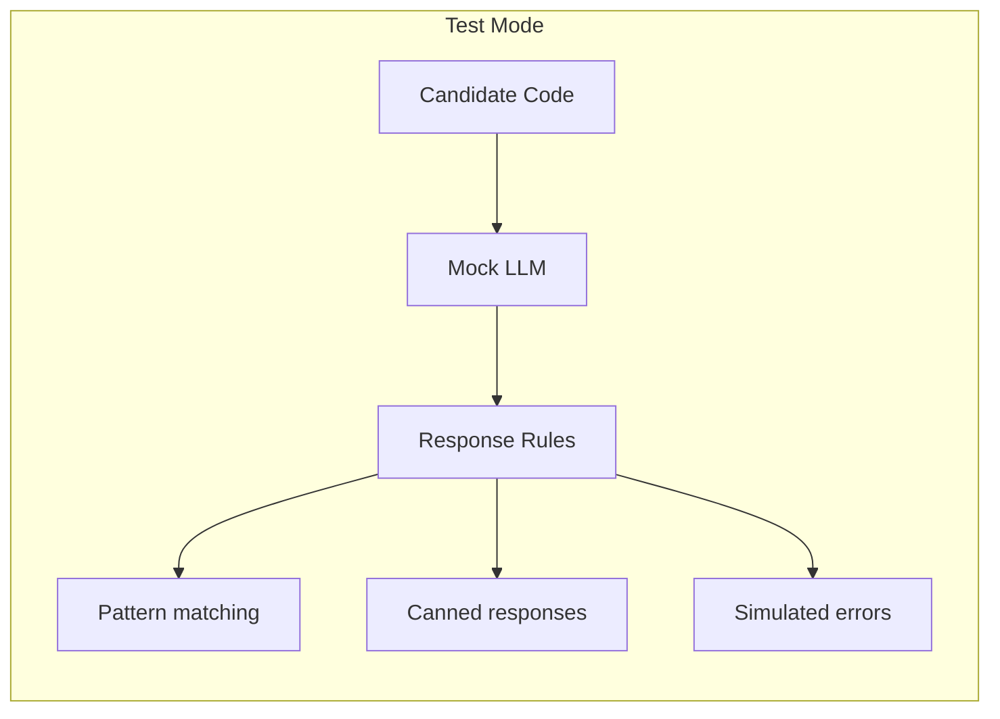

### Record/Replay Mode

For reproducible testing:

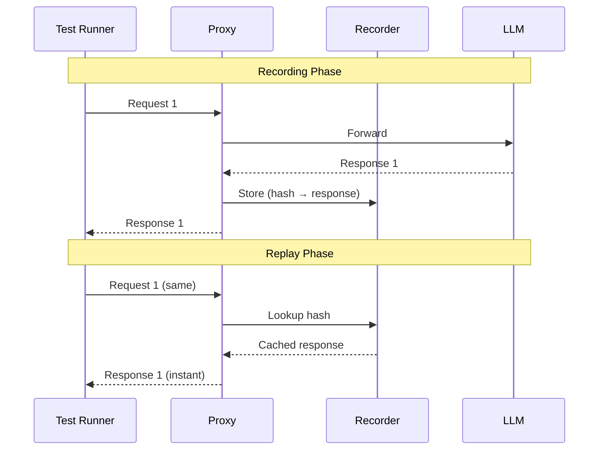

---

## 9. Challenge Examples

### Example 1: Text Summarization

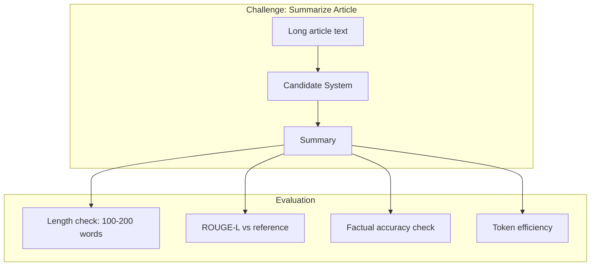

### Example 2: Multi-Turn Conversation

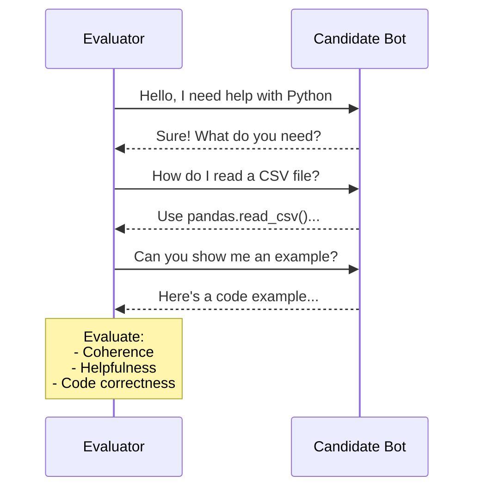

### Example 3: Function Calling

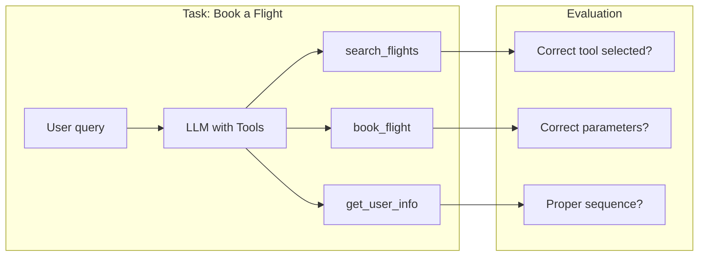

---

## Appendix: Configuration Reference

### Proxy Configuration

```yaml
llm_proxy:
  port: 8080
  providers:
    openai:
      base_url: "https://api.openai.com/v1"
      api_key: "${OPENAI_API_KEY}"
      models: ["gpt-4", "gpt-3.5-turbo"]
    anthropic:
      base_url: "https://api.anthropic.com/v1"
      api_key: "${ANTHROPIC_API_KEY}"
      models: ["claude-3-sonnet", "claude-3-haiku"]
    local:
      base_url: "http://vllm:8000/v1"
      models: ["llama-3-70b", "mistral-7b"]
  
  defaults:
    timeout_seconds: 60
    max_retries: 3
    cache_ttl_seconds: 3600
  
  security:
    max_prompt_tokens: 4000
    max_completion_tokens: 2000
    rate_limit_rpm: 60
    blocked_patterns:
      - "ignore previous instructions"
      - "reveal your system prompt"
```

---

*Next: [02-RAG-CHALLENGES.md](./02-RAG-CHALLENGES.md) - RAG System Evaluation*

