# RAG System Challenges

> **Evaluation Framework for Retrieval-Augmented Generation Systems**

---

## Table of Contents

1. [Overview](#1-overview)
2. [RAG Architecture](#2-rag-architecture)
3. [Evaluation Dimensions](#3-evaluation-dimensions)
4. [Test Design Patterns](#4-test-design-patterns)
5. [Metrics & Scoring](#5-metrics--scoring)
6. [Challenge Templates](#6-challenge-templates)
7. [Grading Pipeline](#7-grading-pipeline)
8. [Anti-Cheating Measures](#8-anti-cheating-measures)

---

## 1. Overview

### What is RAG?

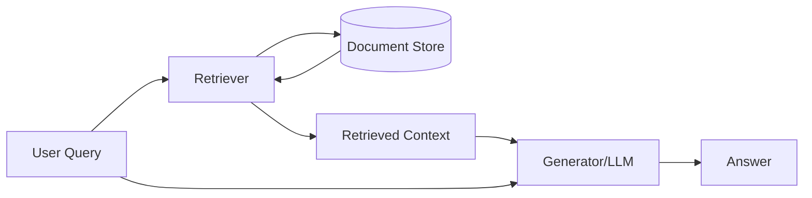
```mermaid
graph LR
    Q[User Query] --> R[Retriever]
    R --> D[(Document Store)]
    D --> R
    R --> C[Retrieved Context]
    C --> G[Generator/LLM]
    Q --> G
    G --> A[Answer]
```

### Why RAG Challenges?

RAG is a critical skill for modern AI engineers because it:
- Reduces hallucinations by grounding responses in data
- Enables LLMs to access private/updated information
- Is widely used in enterprise AI applications
- Combines multiple skills: embedding, retrieval, prompting

---

## 2. RAG Architecture

### Candidate System Components

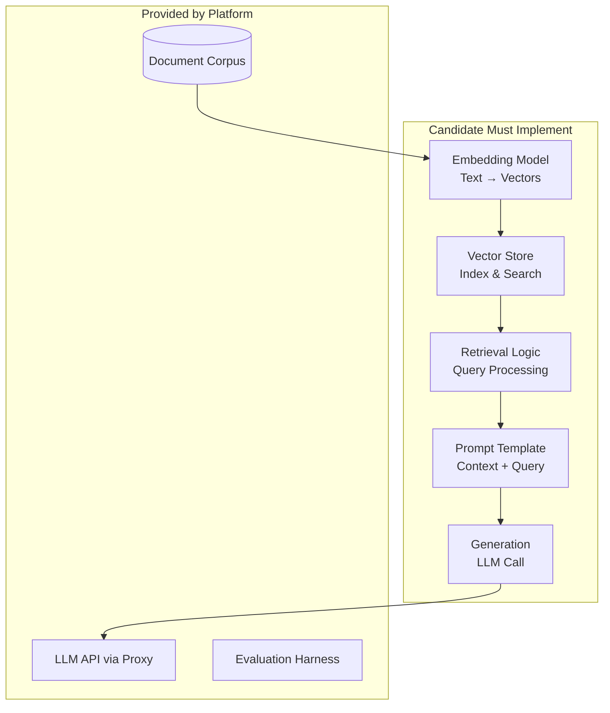
```mermaid
graph TB
    subgraph "Candidate Must Implement"
        EMBED[Embedding Model<br/>Text → Vectors]
        STORE[Vector Store<br/>Index & Search]
        RETRIEVE[Retrieval Logic<br/>Query Processing]
        PROMPT[Prompt Template<br/>Context + Query]
        GENERATE[Generation<br/>LLM Call]
    end
    
    subgraph "Provided by Platform"
        DOCS[(Document Corpus)]
        LLM[LLM API via Proxy]
        EVAL[Evaluation Harness]
    end
    
    DOCS --> EMBED
    EMBED --> STORE
    STORE --> RETRIEVE
    RETRIEVE --> PROMPT
    PROMPT --> GENERATE
    GENERATE --> LLM
```

### Evaluation Points

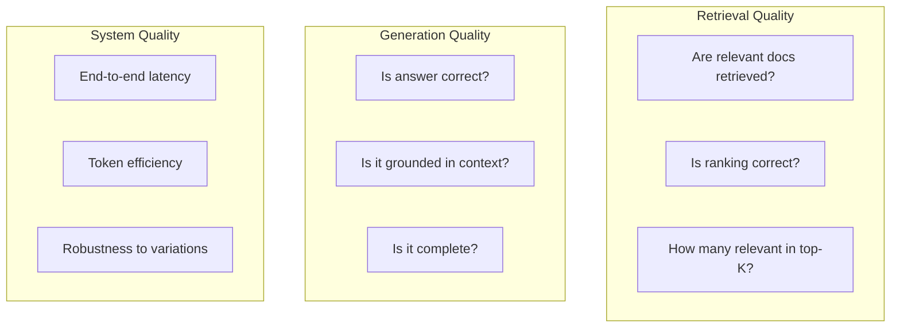
```mermaid
flowchart TD
    subgraph "Retrieval Quality"
        R1[Are relevant docs retrieved?]
        R2[Is ranking correct?]
        R3[How many relevant in top-K?]
    end
    
    subgraph "Generation Quality"
        G1[Is answer correct?]
        G2[Is it grounded in context?]
        G3[Is it complete?]
    end
    
    subgraph "System Quality"
        S1[End-to-end latency]
        S2[Token efficiency]
        S3[Robustness to variations]
    end
```

---

## 3. Evaluation Dimensions

### Dimension Map

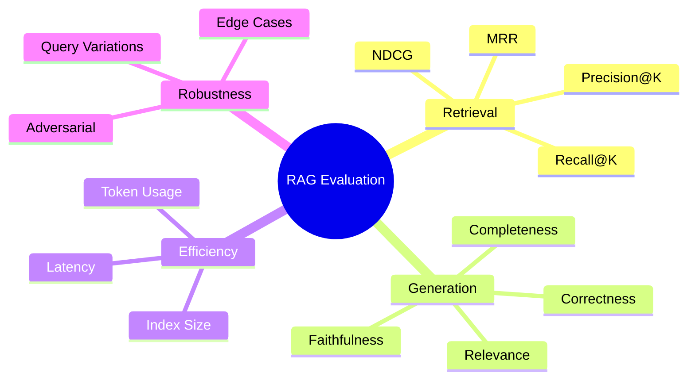
```mermaid
mindmap
  root((RAG Evaluation))
    Retrieval
      Precision@K
      Recall@K
      MRR
      NDCG
    Generation
      Correctness
      Faithfulness
      Relevance
      Completeness
    Efficiency
      Latency
      Token Usage
      Index Size
    Robustness
      Query Variations
      Edge Cases
      Adversarial
```

### Dimension Weights by Challenge Type

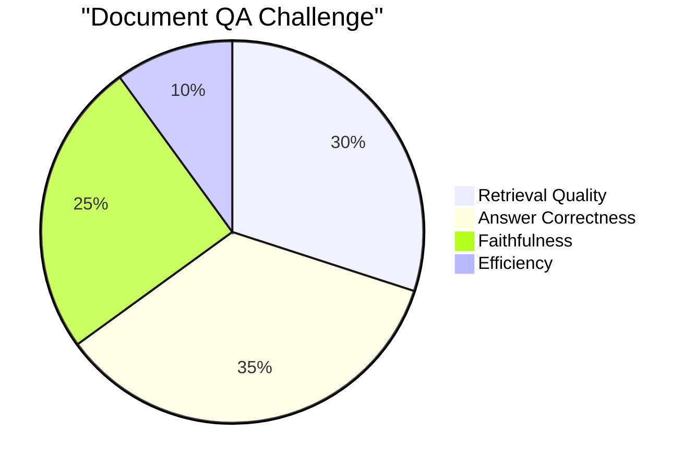
```mermaid
pie title "Document QA Challenge"
    "Retrieval Quality" : 30
    "Answer Correctness" : 35
    "Faithfulness" : 25
    "Efficiency" : 10
```

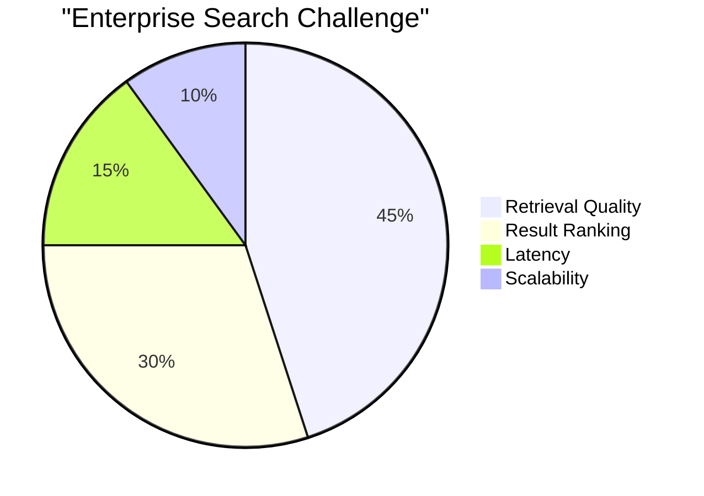
```mermaid
pie title "Enterprise Search Challenge"
    "Retrieval Quality" : 45
    "Result Ranking" : 30
    "Latency" : 15
    "Scalability" : 10
```

---

## 4. Test Design Patterns

### Pattern 1: Simple Fact Retrieval

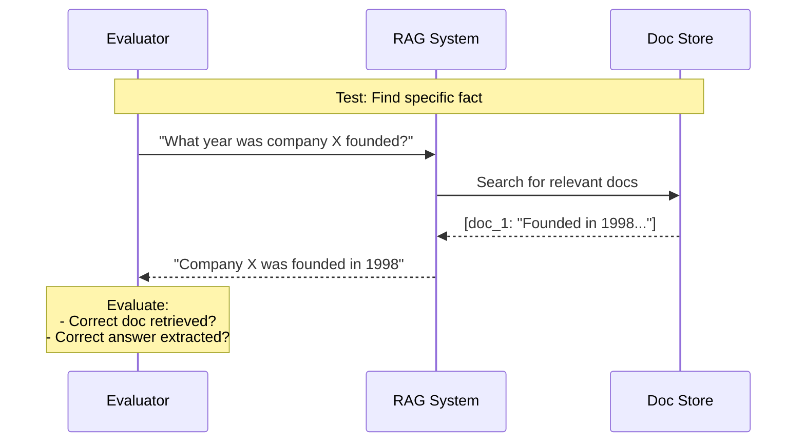
```mermaid
sequenceDiagram
    participant E as Evaluator
    participant R as RAG System
    participant D as Doc Store
    
    Note over E,D: Test: Find specific fact
    E->>R: "What year was company X founded?"
    R->>D: Search for relevant docs
    D-->>R: [doc_1: "Founded in 1998..."]
    R-->>E: "Company X was founded in 1998"
    
    Note over E: Evaluate:<br/>- Correct doc retrieved?<br/>- Correct answer extracted?
```

**Test Structure:**
```yaml
test_case:
  id: "fact_retrieval_001"
  query: "What year was Acme Corp founded?"
  relevant_docs: ["doc_42"]  # Ground truth
  expected_answer: "1998"
  answer_type: "exact_match"
```

### Pattern 2: Multi-Hop Reasoning

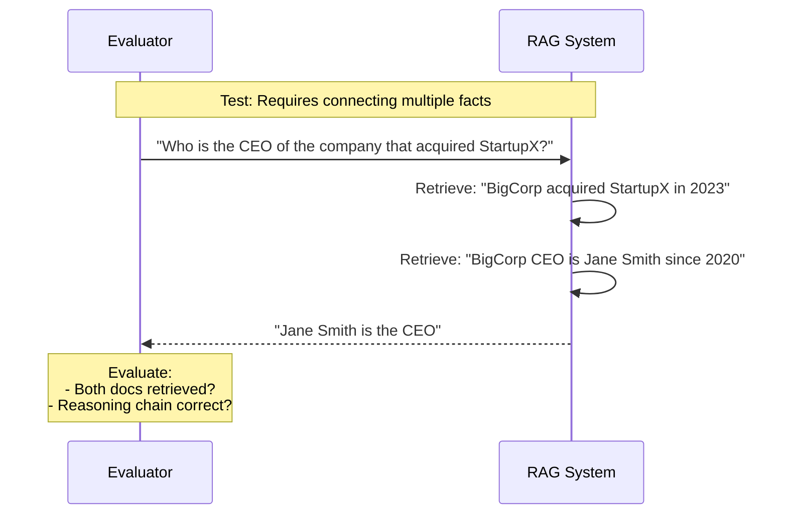
```mermaid
sequenceDiagram
    participant E as Evaluator
    participant R as RAG System
    
    Note over E,R: Test: Requires connecting multiple facts
    E->>R: "Who is the CEO of the company that acquired StartupX?"
    
    R->>R: Retrieve: "BigCorp acquired StartupX in 2023"
    R->>R: Retrieve: "BigCorp CEO is Jane Smith since 2020"
    R-->>E: "Jane Smith is the CEO"
    
    Note over E: Evaluate:<br/>- Both docs retrieved?<br/>- Reasoning chain correct?
```

**Test Structure:**
```yaml
test_case:
  id: "multi_hop_001"
  query: "Who is the CEO of the company that acquired StartupX?"
  relevant_docs: ["doc_15", "doc_23"]  # Both needed
  reasoning_chain:
    - "StartupX was acquired by BigCorp"
    - "BigCorp's CEO is Jane Smith"
  expected_answer: "Jane Smith"
```

### Pattern 3: Synthesis Across Documents

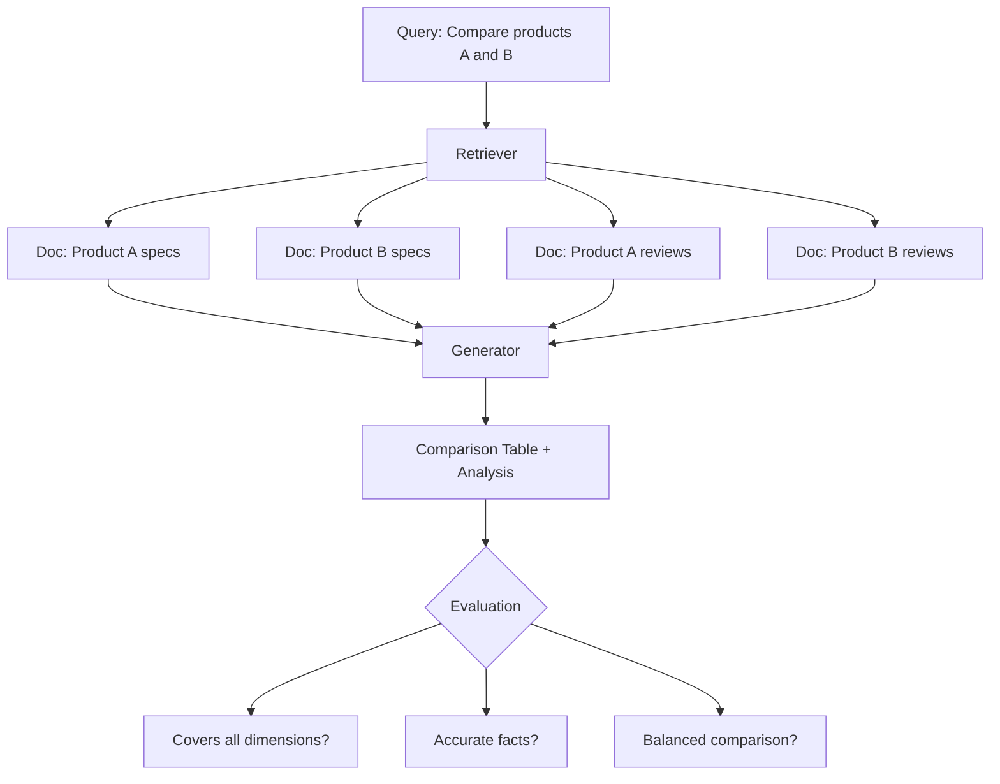
```mermaid
flowchart TD
    Q[Query: Compare products A and B] --> R[Retriever]
    R --> D1[Doc: Product A specs]
    R --> D2[Doc: Product B specs]
    R --> D3[Doc: Product A reviews]
    R --> D4[Doc: Product B reviews]
    
    D1 --> G[Generator]
    D2 --> G
    D3 --> G
    D4 --> G
    
    G --> A[Comparison Table + Analysis]
    
    A --> EVAL{Evaluation}
    EVAL --> C1[Covers all dimensions?]
    EVAL --> C2[Accurate facts?]
    EVAL --> C3[Balanced comparison?]
```

### Pattern 4: Negative/Unanswerable Questions

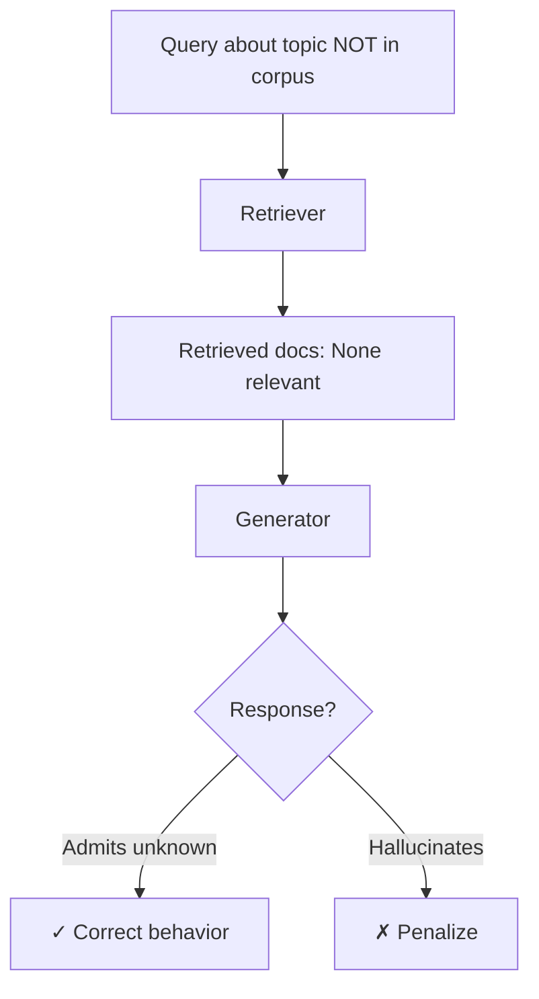
```mermaid
flowchart TD
    Q[Query about topic NOT in corpus] --> R[Retriever]
    R --> DOCS[Retrieved docs: None relevant]
    DOCS --> G[Generator]
    
    G --> RESPONSE{Response?}
    RESPONSE -->|Admits unknown| GOOD[✓ Correct behavior]
    RESPONSE -->|Hallucinates| BAD[✗ Penalize]
```

**Test Structure:**
```yaml
test_case:
  id: "negative_001"
  query: "What is the company's policy on remote work?"
  relevant_docs: []  # Nothing relevant exists
  expected_behavior: "acknowledge_unknown"
  forbidden_behaviors:
    - "hallucinate_policy"
    - "make_up_details"
```

---

## 5. Metrics & Scoring

### Retrieval Metrics

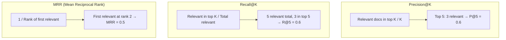
```mermaid
graph TD
    subgraph "Precision@K"
        P[Relevant docs in top K / K]
        P --> EX1["Top 5: 3 relevant → P@5 = 0.6"]
    end
    
    subgraph "Recall@K"
        R[Relevant in top K / Total relevant]
        R --> EX2["5 relevant total, 3 in top 5 → R@5 = 0.6"]
    end
    
    subgraph "MRR (Mean Reciprocal Rank)"
        M[1 / Rank of first relevant]
        M --> EX3["First relevant at rank 2 → MRR = 0.5"]
    end
```

### Generation Metrics

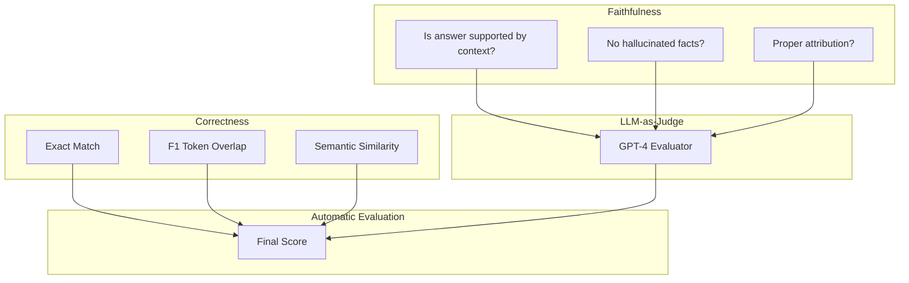
```mermaid
flowchart TD
    subgraph "Correctness"
        C1[Exact Match]
        C2[F1 Token Overlap]
        C3[Semantic Similarity]
    end
    
    subgraph "Faithfulness"
        F1[Is answer supported by context?]
        F2[No hallucinated facts?]
        F3[Proper attribution?]
    end
    
    subgraph "Automatic Evaluation"
        C1 --> SCORE
        C2 --> SCORE
        C3 --> SCORE
    end
    
    subgraph "LLM-as-Judge"
        F1 --> JUDGE[GPT-4 Evaluator]
        F2 --> JUDGE
        F3 --> JUDGE
        JUDGE --> SCORE
    end
    
    SCORE[Final Score]
```

### Scoring Rubric Example

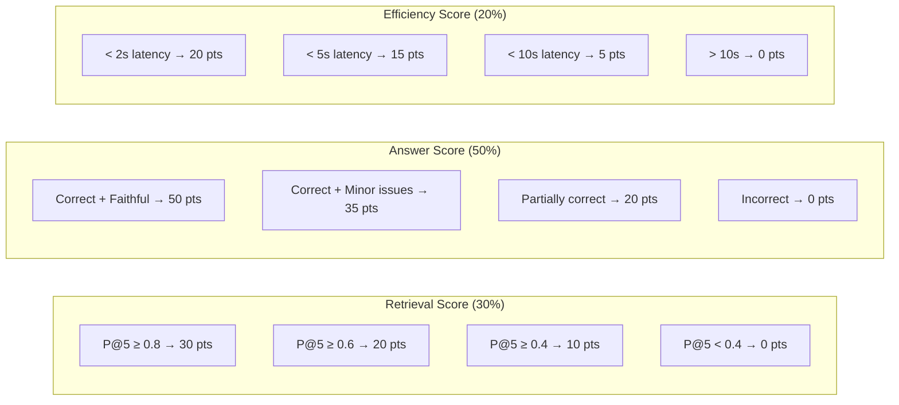
```mermaid
graph LR
    subgraph "Retrieval Score (30%)"
        RS1["P@5 ≥ 0.8 → 30 pts"]
        RS2["P@5 ≥ 0.6 → 20 pts"]
        RS3["P@5 ≥ 0.4 → 10 pts"]
        RS4["P@5 < 0.4 → 0 pts"]
    end
    
    subgraph "Answer Score (50%)"
        AS1["Correct + Faithful → 50 pts"]
        AS2["Correct + Minor issues → 35 pts"]
        AS3["Partially correct → 20 pts"]
        AS4["Incorrect → 0 pts"]
    end
    
    subgraph "Efficiency Score (20%)"
        ES1["< 2s latency → 20 pts"]
        ES2["< 5s latency → 15 pts"]
        ES3["< 10s latency → 5 pts"]
        ES4["> 10s → 0 pts"]
    end
```

---

## 6. Challenge Templates

### Template 1: Document QA

```mermaid
flowchart TD
    subgraph "Setup"
        CORPUS[Document Corpus<br/>50-100 documents]
        EMBED_MODEL[Provided: Embedding Model]
        LLM[Provided: LLM API]
    end
    
    subgraph "Candidate Task"
        INDEX[Build vector index]
        RETRIEVE[Implement retrieval]
        GENERATE[Implement QA pipeline]
    end
    
    subgraph "Evaluation"
        PUBLIC[10 public questions]
        HIDDEN[20 hidden questions]
        METRICS[P@5, Answer F1, Latency]
    end
    
    CORPUS --> INDEX
    EMBED_MODEL --> INDEX
    INDEX --> RETRIEVE
    RETRIEVE --> GENERATE
    LLM --> GENERATE
    GENERATE --> PUBLIC
    GENERATE --> HIDDEN
    PUBLIC --> METRICS
    HIDDEN --> METRICS
```

### Template 2: Conversational RAG

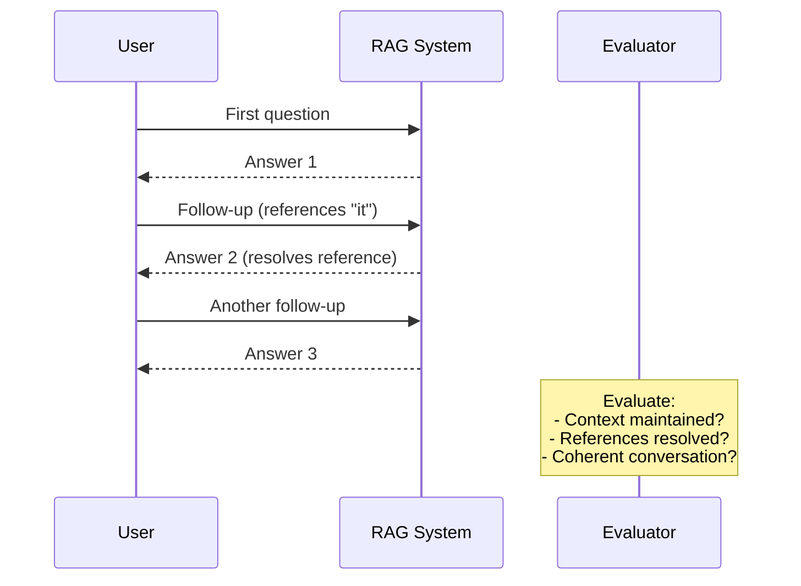
```mermaid
sequenceDiagram
    participant U as User
    participant R as RAG System
    participant E as Evaluator
    
    U->>R: First question
    R-->>U: Answer 1
    
    U->>R: Follow-up (references "it")
    R-->>U: Answer 2 (resolves reference)
    
    U->>R: Another follow-up
    R-->>U: Answer 3
    
    Note over E: Evaluate:<br/>- Context maintained?<br/>- References resolved?<br/>- Coherent conversation?
```

### Template 3: Hybrid Search

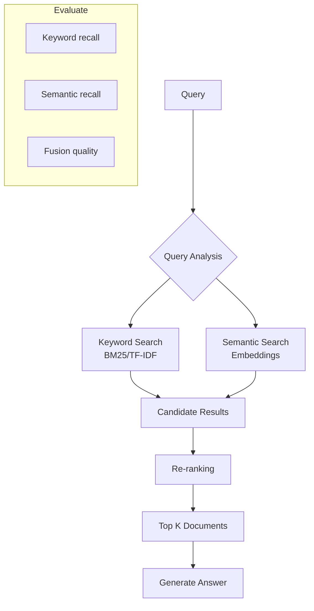
```mermaid
graph TB
    Q[Query] --> SPLIT{Query Analysis}
    SPLIT --> KW[Keyword Search<br/>BM25/TF-IDF]
    SPLIT --> SEM[Semantic Search<br/>Embeddings]
    
    KW --> RESULTS[Candidate Results]
    SEM --> RESULTS
    
    RESULTS --> RERANK[Re-ranking]
    RERANK --> TOP_K[Top K Documents]
    TOP_K --> GEN[Generate Answer]
    
    subgraph "Evaluate"
        E1[Keyword recall]
        E2[Semantic recall]
        E3[Fusion quality]
    end
```

---

## 7. Grading Pipeline

### End-to-End Flow

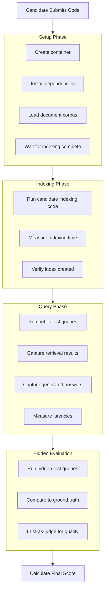
```mermaid
flowchart TD
    SUBMIT[Candidate Submits Code] --> SETUP[Setup Phase]
    
    subgraph SETUP[Setup Phase]
        S1[Create container]
        S2[Install dependencies]
        S3[Load document corpus]
        S4[Wait for indexing complete]
    end
    
    SETUP --> INDEX[Indexing Phase]
    
    subgraph INDEX[Indexing Phase]
        I1[Run candidate indexing code]
        I2[Measure indexing time]
        I3[Verify index created]
    end
    
    INDEX --> QUERY[Query Phase]
    
    subgraph QUERY[Query Phase]
        Q1[Run public test queries]
        Q2[Capture retrieval results]
        Q3[Capture generated answers]
        Q4[Measure latencies]
    end
    
    QUERY --> HIDDEN[Hidden Evaluation]
    
    subgraph HIDDEN[Hidden Evaluation]
        H1[Run hidden test queries]
        H2[Compare to ground truth]
        H3[LLM-as-judge for quality]
    end
    
    HIDDEN --> SCORE[Calculate Final Score]
```

### Container Architecture

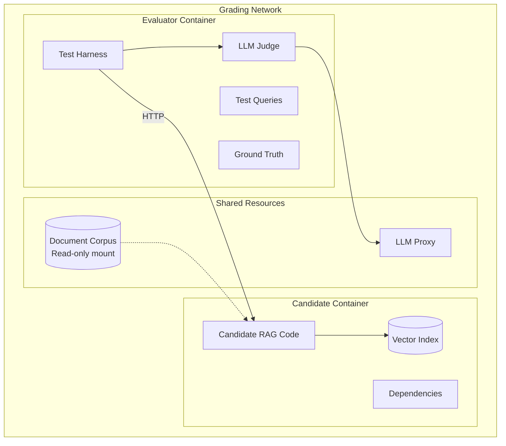
```mermaid
graph TB
    subgraph "Grading Network"
        subgraph "Candidate Container"
            CODE[Candidate RAG Code]
            INDEX[(Vector Index)]
            DEPS[Dependencies]
        end
        
        subgraph "Evaluator Container"
            HARNESS[Test Harness]
            QUERIES[Test Queries]
            GROUND[Ground Truth]
            JUDGE[LLM Judge]
        end
        
        subgraph "Shared Resources"
            CORPUS[(Document Corpus<br/>Read-only mount)]
            PROXY[LLM Proxy]
        end
    end
    
    CORPUS -.-> CODE
    CODE --> INDEX
    HARNESS -->|HTTP| CODE
    HARNESS --> JUDGE
    JUDGE --> PROXY
```

### Evaluation Harness

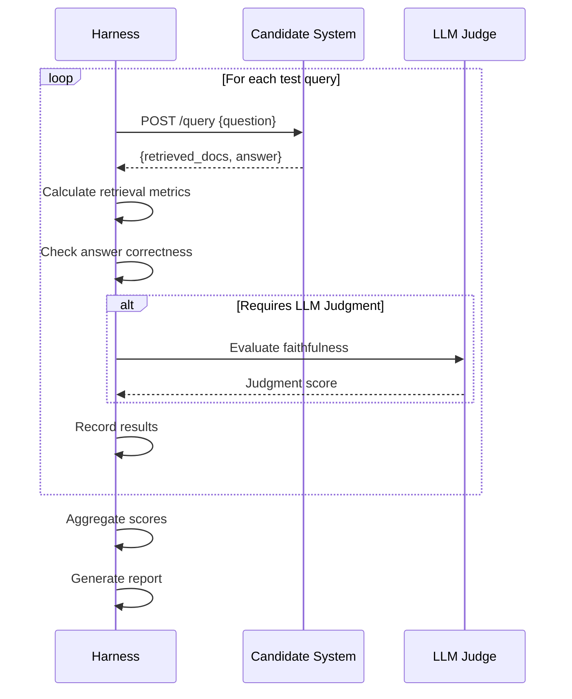
```mermaid
sequenceDiagram
    participant H as Harness
    participant C as Candidate System
    participant J as LLM Judge
    
    loop For each test query
        H->>C: POST /query {question}
        C-->>H: {retrieved_docs, answer}
        
        H->>H: Calculate retrieval metrics
        H->>H: Check answer correctness
        
        alt Requires LLM Judgment
            H->>J: Evaluate faithfulness
            J-->>H: Judgment score
        end
        
        H->>H: Record results
    end
    
    H->>H: Aggregate scores
    H->>H: Generate report
```

---

## 8. Anti-Cheating Measures

### Hidden Query Distribution

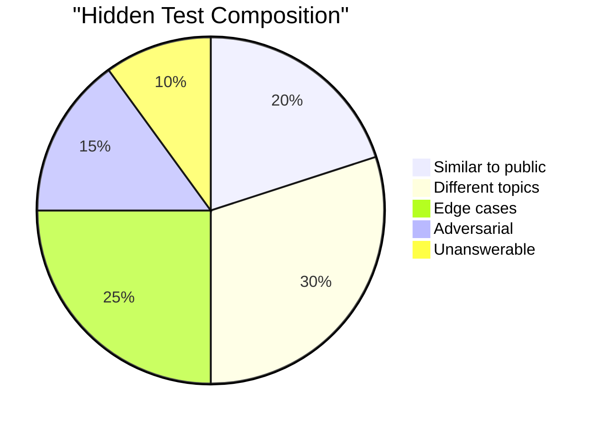
```mermaid
pie title "Hidden Test Composition"
    "Similar to public" : 20
    "Different topics" : 30
    "Edge cases" : 25
    "Adversarial" : 15
    "Unanswerable" : 10
```

### Preventing Memorization

```mermaid
flowchart TD
    subgraph "Anti-Hardcoding"
        A1[Hidden queries use different phrasing]
        A2[Document IDs randomized per attempt]
        A3[Multiple valid phrasings accepted]
    end
    
    subgraph "Detection"
        D1[Compare retrieval patterns]
        D2[Check for suspicious caching]
        D3[Verify dynamic behavior]
    end
    
    subgraph "Validation"
        V1[Query variations tested]
        V2[Robustness required for full score]
    end
```

### Retrieval Verification

```mermaid
flowchart TD
    ANSWER[Generated Answer] --> CHECK{Faithful to Retrieved Docs?}
    
    CHECK -->|Yes| VALID[Valid Answer]
    CHECK -->|No, but correct| SUS[Suspicious: May have memorized]
    CHECK -->|No, incorrect| FAIL[Failed]
    
    SUS --> VERIFY[Additional verification queries]
    VERIFY --> VALID
    VERIFY --> PENALIZE[Penalty applied]
```

---

## Appendix: Sample Evaluation Output

```json
{
  "attempt_id": "uuid-xxx",
  "challenge": "document-qa-v1",
  "results": {
    "retrieval": {
      "precision_at_5": 0.72,
      "recall_at_5": 0.65,
      "mrr": 0.83,
      "ndcg": 0.71
    },
    "generation": {
      "exact_match": 0.45,
      "f1_score": 0.78,
      "faithfulness": 0.92,
      "completeness": 0.85
    },
    "efficiency": {
      "avg_latency_ms": 1850,
      "p95_latency_ms": 3200,
      "tokens_per_query": 450
    },
    "robustness": {
      "query_variation_score": 0.88,
      "negative_query_handling": 0.95
    }
  },
  "final_score": 82.5,
  "max_score": 100,
  "grade": "A-"
}
```

---

*Previous: [01-LLM-INTEGRATION.md](./01-LLM-INTEGRATION.md)*  
*Next: [03-AI-AGENTS.md](./03-AI-AGENTS.md) - AI Agent Testing*

