# AI Agent Testing Methodology

> **Framework for Evaluating Autonomous AI Agents with Tool Use**

---

## Table of Contents

1. [Overview](#1-overview)
2. [Agent Architecture](#2-agent-architecture)
3. [Evaluation Framework](#3-evaluation-framework)
4. [Test Environment Design](#4-test-environment-design)
5. [Scoring Methodology](#5-scoring-methodology)
6. [Challenge Types](#6-challenge-types)
7. [Safety & Guardrails](#7-safety--guardrails)
8. [Grading Pipeline](#8-grading-pipeline)

---

## 1. Overview

### What is an AI Agent?

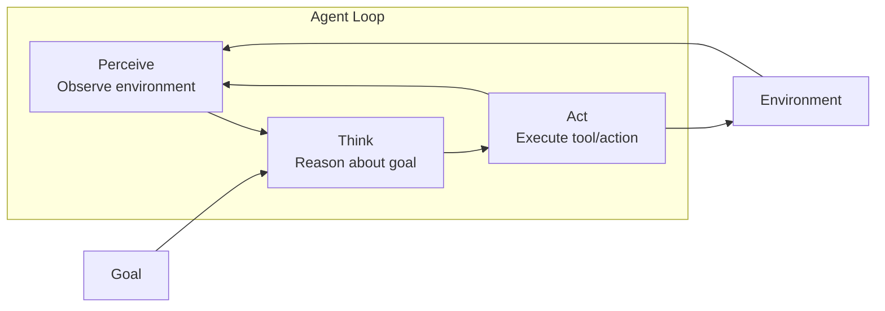
```mermaid
graph LR
    subgraph "Agent Loop"
        PERCEIVE[Perceive<br/>Observe environment] --> THINK[Think<br/>Reason about goal]
        THINK --> ACT[Act<br/>Execute tool/action]
        ACT --> PERCEIVE
    end
    
    ACT --> ENV[Environment]
    ENV --> PERCEIVE
    
    GOAL[Goal] --> THINK
```

### Why Agent Challenges Matter

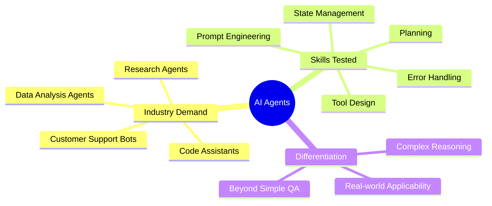
```mermaid
mindmap
  root((AI Agents))
    Industry Demand
      Customer Support Bots
      Data Analysis Agents
      Code Assistants
      Research Agents
    Skills Tested
      Prompt Engineering
      Tool Design
      Error Handling
      Planning
      State Management
    Differentiation
      Complex Reasoning
      Real-world Applicability
      Beyond Simple QA
```

---

## 2. Agent Architecture

### Standard Agent Components

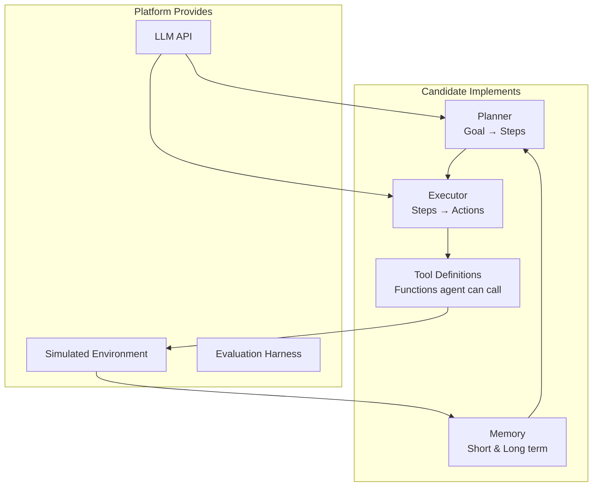
```mermaid
graph TB
    subgraph "Candidate Implements"
        PLANNER[Planner<br/>Goal → Steps]
        EXECUTOR[Executor<br/>Steps → Actions]
        MEMORY[Memory<br/>Short & Long term]
        TOOLS[Tool Definitions<br/>Functions agent can call]
    end
    
    subgraph "Platform Provides"
        LLM[LLM API]
        ENV[Simulated Environment]
        EVAL[Evaluation Harness]
    end
    
    PLANNER --> EXECUTOR
    EXECUTOR --> TOOLS
    TOOLS --> ENV
    ENV --> MEMORY
    MEMORY --> PLANNER
    
    LLM --> PLANNER
    LLM --> EXECUTOR
```

### Agent Execution Flow

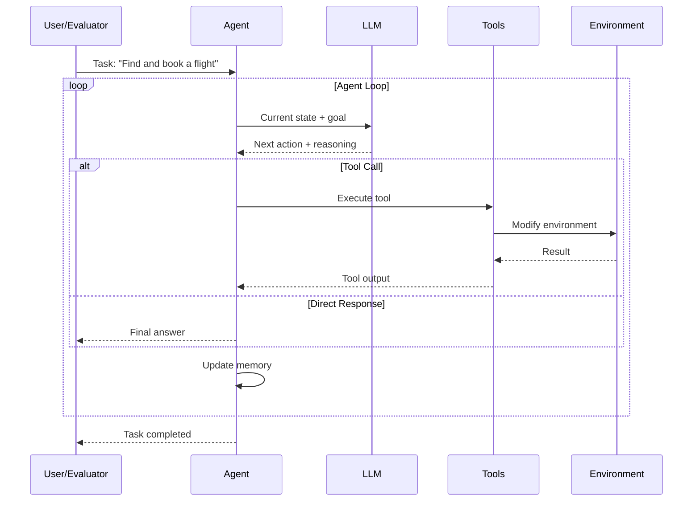
```mermaid
sequenceDiagram
    participant U as User/Evaluator
    participant A as Agent
    participant LLM as LLM
    participant T as Tools
    participant E as Environment
    
    U->>A: Task: "Find and book a flight"
    
    loop Agent Loop
        A->>LLM: Current state + goal
        LLM-->>A: Next action + reasoning
        
        alt Tool Call
            A->>T: Execute tool
            T->>E: Modify environment
            E-->>T: Result
            T-->>A: Tool output
        else Direct Response
            A-->>U: Final answer
        end
        
        A->>A: Update memory
    end
    
    A-->>U: Task completed
```

### ReAct Pattern

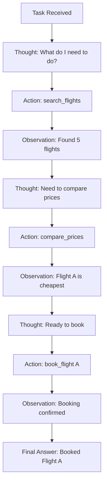
```mermaid
flowchart TD
    START[Task Received] --> THINK1[Thought: What do I need to do?]
    THINK1 --> ACT1[Action: search_flights]
    ACT1 --> OBS1[Observation: Found 5 flights]
    
    OBS1 --> THINK2[Thought: Need to compare prices]
    THINK2 --> ACT2[Action: compare_prices]
    ACT2 --> OBS2[Observation: Flight A is cheapest]
    
    OBS2 --> THINK3[Thought: Ready to book]
    THINK3 --> ACT3[Action: book_flight A]
    ACT3 --> OBS3[Observation: Booking confirmed]
    
    OBS3 --> DONE[Final Answer: Booked Flight A]
```

---

## 3. Evaluation Framework

### Multi-Dimensional Assessment


```mermaid
graph TB
    subgraph "Task Completion (40%)"
        TC1[Goal achieved?]
        TC2[Correct final state?]
        TC3[All requirements met?]
    end
    
    subgraph "Reasoning Quality (25%)"
        RQ1[Logical thought process?]
        RQ2[Appropriate tool selection?]
        RQ3[Handles ambiguity well?]
    end
    
    subgraph "Efficiency (20%)"
        EF1[Minimal tool calls?]
        EF2[No redundant actions?]
        EF3[Fast execution?]
    end
    
    subgraph "Robustness (15%)"
        RB1[Handles errors gracefully?]
        RB2[Recovers from failures?]
        RB3[Doesn't get stuck in loops?]
    end
    
    TC1 --> SCORE[Final Score]
    RQ1 --> SCORE
    EF1 --> SCORE
    RB1 --> SCORE
```

### Evaluation Signals

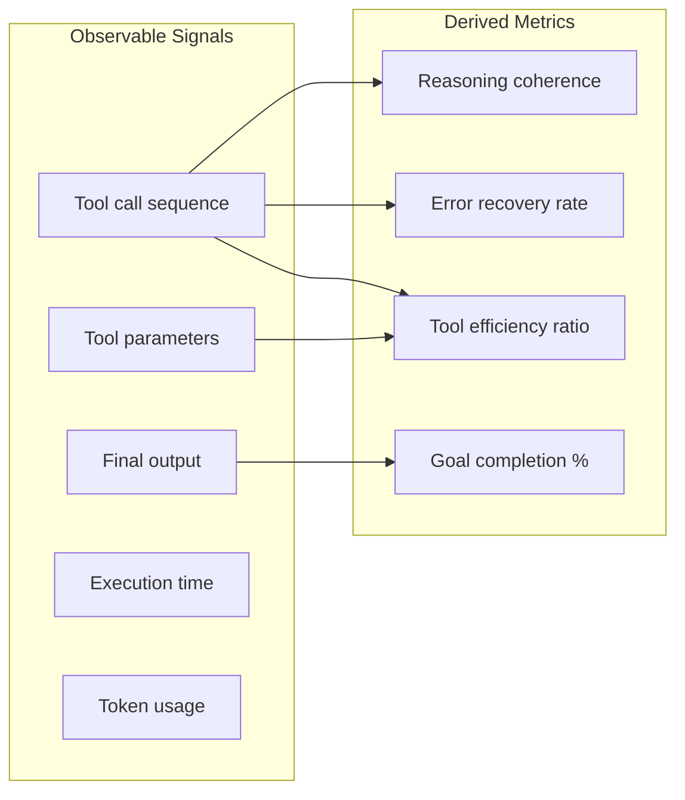
```mermaid
flowchart LR
    subgraph "Observable Signals"
        S1[Tool call sequence]
        S2[Tool parameters]
        S3[Final output]
        S4[Execution time]
        S5[Token usage]
    end
    
    subgraph "Derived Metrics"
        M1[Tool efficiency ratio]
        M2[Error recovery rate]
        M3[Goal completion %]
        M4[Reasoning coherence]
    end
    
    S1 --> M1
    S2 --> M1
    S3 --> M3
    S1 --> M2
    S1 --> M4
```

---

## 4. Test Environment Design

### Simulated Environment Architecture

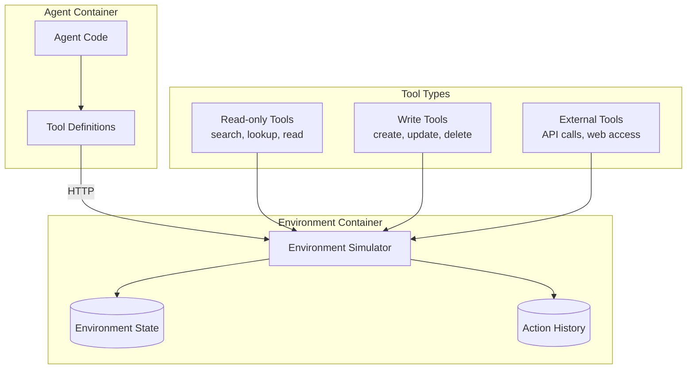
```mermaid
graph TB
    subgraph "Agent Container"
        AGENT[Agent Code]
        TOOLS[Tool Definitions]
    end
    
    subgraph "Environment Container"
        SIM[Environment Simulator]
        STATE[(Environment State)]
        HISTORY[(Action History)]
    end
    
    subgraph "Tool Types"
        T1[Read-only Tools<br/>search, lookup, read]
        T2[Write Tools<br/>create, update, delete]
        T3[External Tools<br/>API calls, web access]
    end
    
    AGENT --> TOOLS
    TOOLS -->|HTTP| SIM
    SIM --> STATE
    SIM --> HISTORY
    
    T1 --> SIM
    T2 --> SIM
    T3 --> SIM
```

### Environment State Machine

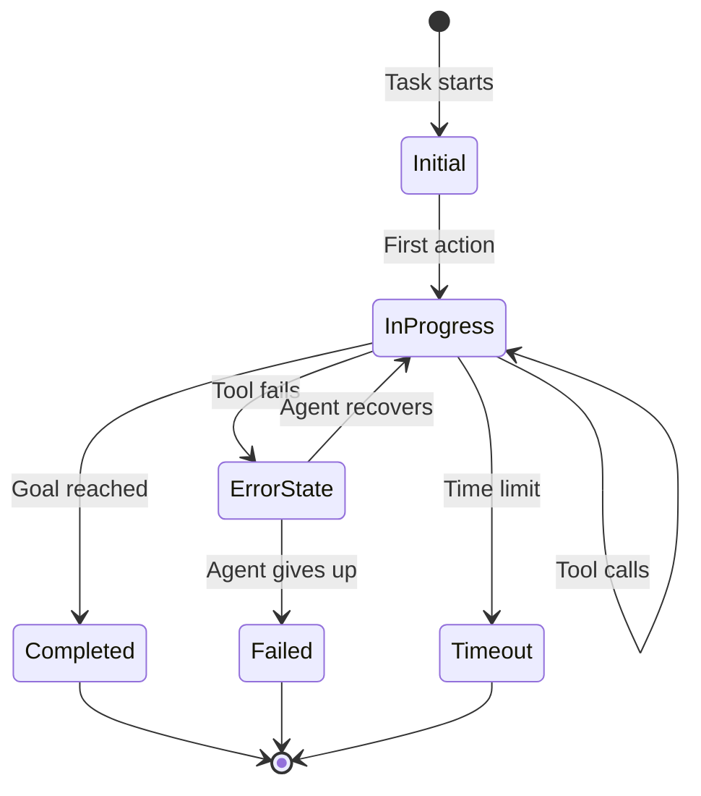
```mermaid
stateDiagram-v2
    [*] --> Initial: Task starts
    Initial --> InProgress: First action
    InProgress --> InProgress: Tool calls
    InProgress --> ErrorState: Tool fails
    ErrorState --> InProgress: Agent recovers
    ErrorState --> Failed: Agent gives up
    InProgress --> Completed: Goal reached
    InProgress --> Timeout: Time limit
    Completed --> [*]
    Failed --> [*]
    Timeout --> [*]
```

### Tool Simulation

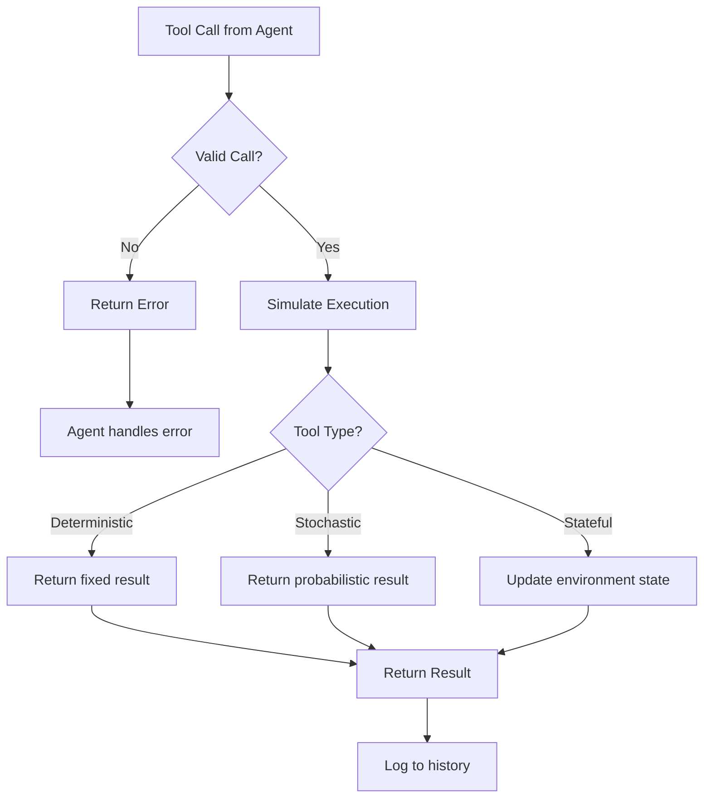
```mermaid
flowchart TD
    CALL[Tool Call from Agent] --> VALIDATE{Valid Call?}
    
    VALIDATE -->|No| ERROR[Return Error]
    ERROR --> AGENT[Agent handles error]
    
    VALIDATE -->|Yes| SIMULATE[Simulate Execution]
    
    SIMULATE --> TYPE{Tool Type?}
    
    TYPE -->|Deterministic| DET[Return fixed result]
    TYPE -->|Stochastic| STOCH[Return probabilistic result]
    TYPE -->|Stateful| STATE[Update environment state]
    
    DET --> RESULT[Return Result]
    STOCH --> RESULT
    STATE --> RESULT
    
    RESULT --> LOG[Log to history]
```

---

## 5. Scoring Methodology

### Action-Level Scoring

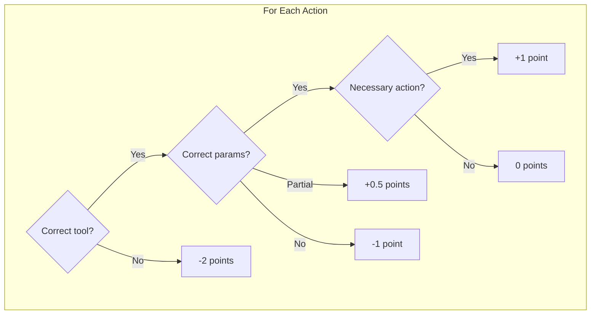
```mermaid
flowchart TD
    subgraph "For Each Action"
        A1{Correct tool?}
        A1 -->|Yes| A2{Correct params?}
        A1 -->|No| WRONG_TOOL[-2 points]
        
        A2 -->|Yes| A3{Necessary action?}
        A2 -->|Partial| PARTIAL_PARAM[+0.5 points]
        A2 -->|No| WRONG_PARAM[-1 point]
        
        A3 -->|Yes| GOOD[+1 point]
        A3 -->|No| REDUNDANT[0 points]
    end
```

### Trajectory Scoring

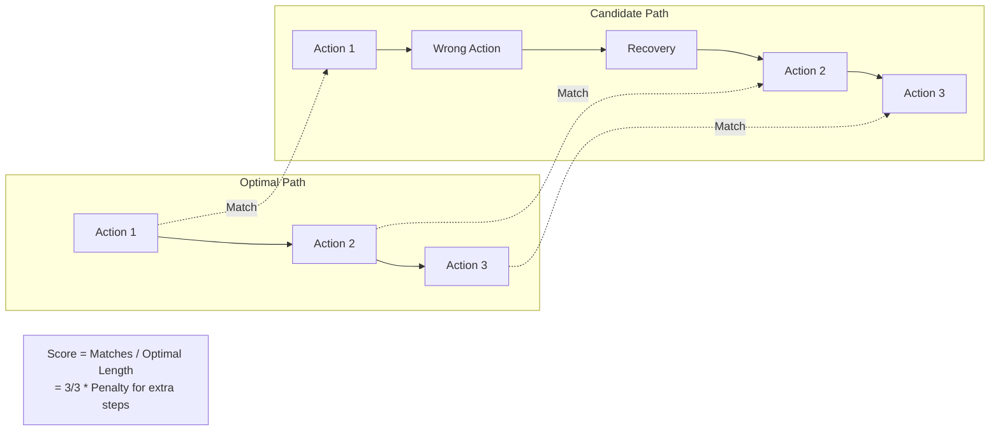
```mermaid
graph LR
    subgraph "Optimal Path"
        O1[Action 1] --> O2[Action 2] --> O3[Action 3]
    end
    
    subgraph "Candidate Path"
        C1[Action 1] --> C2[Wrong Action] --> C3[Recovery] --> C4[Action 2] --> C5[Action 3]
    end
    
    O1 -.->|Match| C1
    O2 -.->|Match| C4
    O3 -.->|Match| C5
    
    SCORE[Score = Matches / Optimal Length<br/>= 3/3 * Penalty for extra steps]
```

### Final Score Calculation

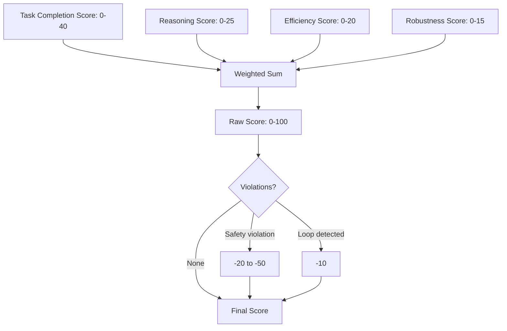
```mermaid
flowchart TD
    TASK[Task Completion Score: 0-40]
    REASON[Reasoning Score: 0-25]
    EFFIC[Efficiency Score: 0-20]
    ROBUST[Robustness Score: 0-15]
    
    TASK --> COMBINE
    REASON --> COMBINE
    EFFIC --> COMBINE
    ROBUST --> COMBINE
    
    COMBINE[Weighted Sum] --> RAW[Raw Score: 0-100]
    RAW --> PENALTY{Violations?}
    
    PENALTY -->|Safety violation| REDUCE[-20 to -50]
    PENALTY -->|Loop detected| REDUCE2[-10]
    PENALTY -->|None| FINAL[Final Score]
    
    REDUCE --> FINAL
    REDUCE2 --> FINAL
```

---

## 6. Challenge Types

### Type 1: Single-Domain Task Completion

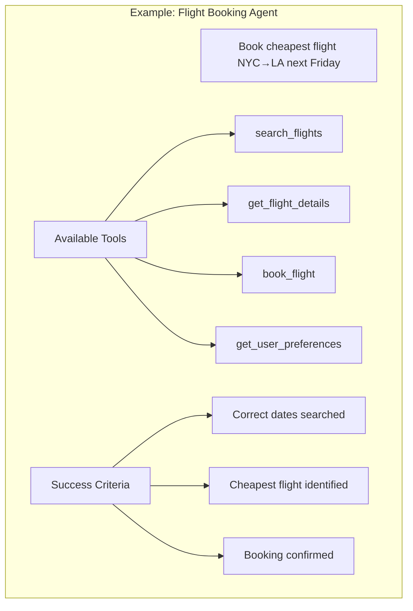
```mermaid
graph TD
    subgraph "Example: Flight Booking Agent"
        GOAL[Book cheapest flight NYC→LA next Friday]
        
        TOOLS_AVAIL[Available Tools]
        TOOLS_AVAIL --> T1[search_flights]
        TOOLS_AVAIL --> T2[get_flight_details]
        TOOLS_AVAIL --> T3[book_flight]
        TOOLS_AVAIL --> T4[get_user_preferences]
        
        SUCCESS[Success Criteria]
        SUCCESS --> S1[Correct dates searched]
        SUCCESS --> S2[Cheapest flight identified]
        SUCCESS --> S3[Booking confirmed]
    end
```

### Type 2: Multi-Step Research Agent

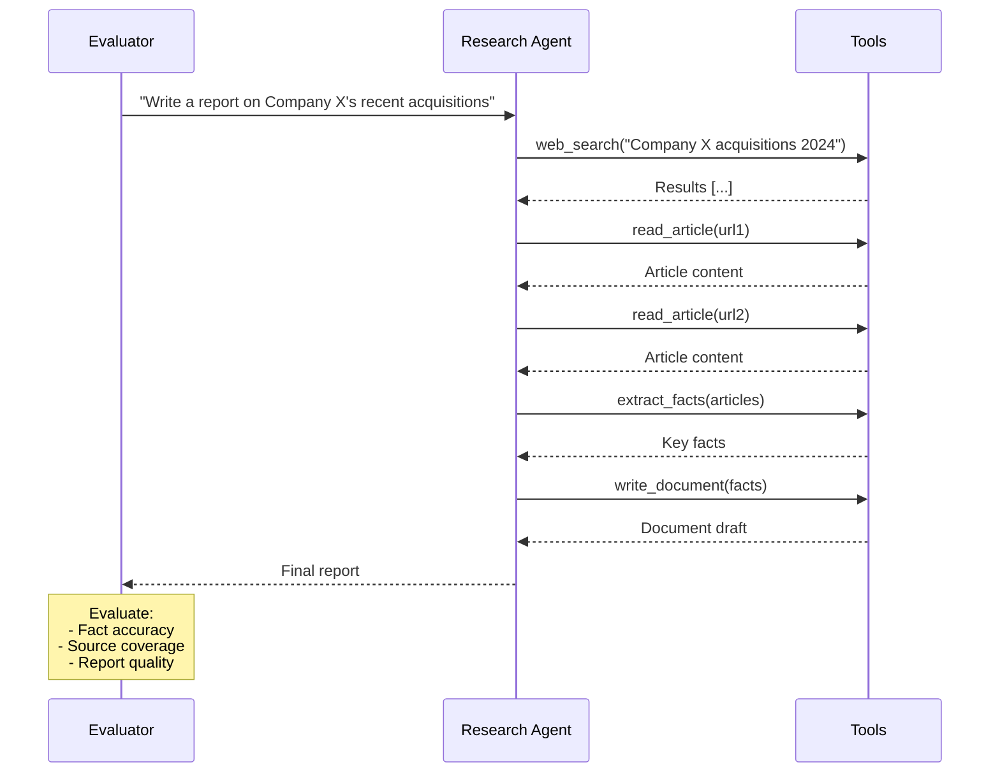
```mermaid
sequenceDiagram
    participant E as Evaluator
    participant A as Research Agent
    participant T as Tools
    
    E->>A: "Write a report on Company X's recent acquisitions"
    
    A->>T: web_search("Company X acquisitions 2024")
    T-->>A: Results [...]
    
    A->>T: read_article(url1)
    T-->>A: Article content
    
    A->>T: read_article(url2)
    T-->>A: Article content
    
    A->>T: extract_facts(articles)
    T-->>A: Key facts
    
    A->>T: write_document(facts)
    T-->>A: Document draft
    
    A-->>E: Final report
    
    Note over E: Evaluate:<br/>- Fact accuracy<br/>- Source coverage<br/>- Report quality
```

### Type 3: Interactive Agent

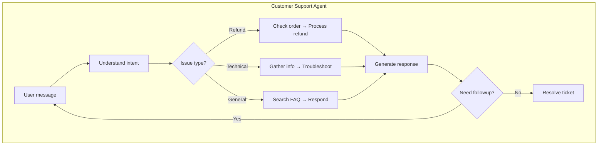
```mermaid
flowchart TD
    subgraph "Customer Support Agent"
        USER[User message] --> UNDERSTAND[Understand intent]
        UNDERSTAND --> CLASSIFY{Issue type?}
        
        CLASSIFY -->|Refund| REFUND[Check order → Process refund]
        CLASSIFY -->|Technical| TECH[Gather info → Troubleshoot]
        CLASSIFY -->|General| FAQ[Search FAQ → Respond]
        
        REFUND --> RESPOND[Generate response]
        TECH --> RESPOND
        FAQ --> RESPOND
        
        RESPOND --> FOLLOWUP{Need followup?}
        FOLLOWUP -->|Yes| USER
        FOLLOWUP -->|No| RESOLVE[Resolve ticket]
    end
```

### Type 4: Code Agent

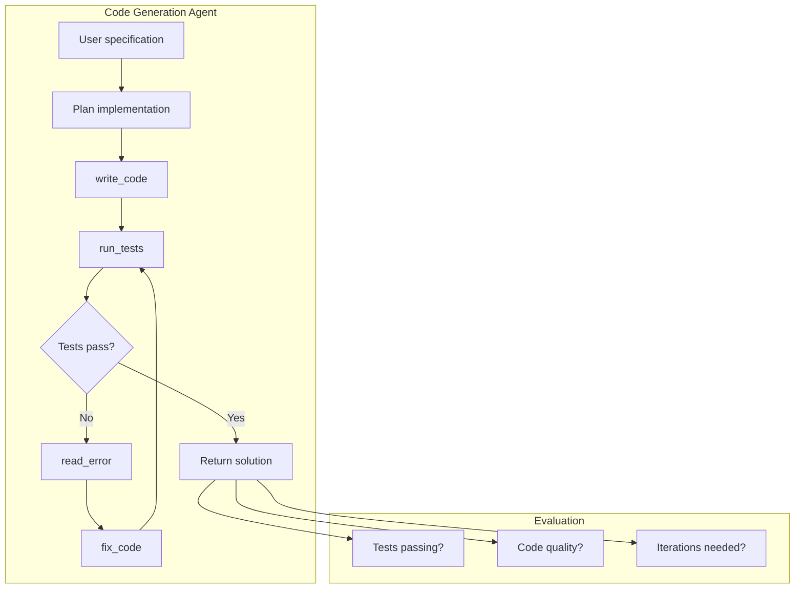
```mermaid
graph TD
    subgraph "Code Generation Agent"
        SPEC[User specification] --> PLAN[Plan implementation]
        
        PLAN --> WRITE[write_code]
        WRITE --> RUN[run_tests]
        
        RUN --> CHECK{Tests pass?}
        CHECK -->|No| DEBUG[read_error]
        DEBUG --> FIX[fix_code]
        FIX --> RUN
        
        CHECK -->|Yes| DONE[Return solution]
    end
    
    subgraph "Evaluation"
        DONE --> E1[Tests passing?]
        DONE --> E2[Code quality?]
        DONE --> E3[Iterations needed?]
    end
```

### Type 5: Multi-Agent Coordination

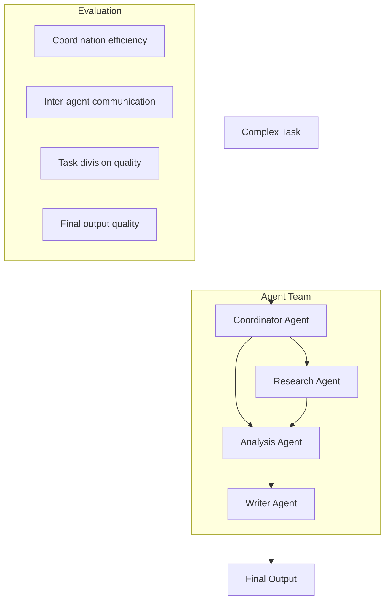
```mermaid
graph TB
    subgraph "Agent Team"
        COORD[Coordinator Agent]
        RESEARCH[Research Agent]
        ANALYST[Analysis Agent]
        WRITER[Writer Agent]
    end
    
    TASK[Complex Task] --> COORD
    COORD --> RESEARCH
    COORD --> ANALYST
    RESEARCH --> ANALYST
    ANALYST --> WRITER
    WRITER --> OUTPUT[Final Output]
    
    subgraph "Evaluation"
        E1[Coordination efficiency]
        E2[Inter-agent communication]
        E3[Task division quality]
        E4[Final output quality]
    end
```

---

## 7. Safety & Guardrails

### Safety Boundaries

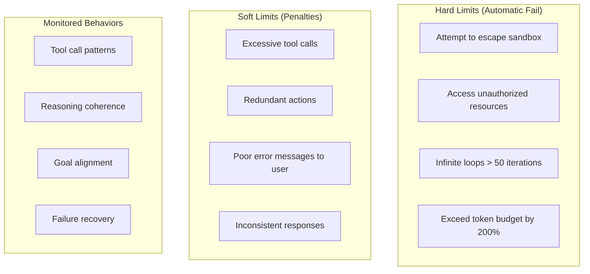
```mermaid
graph TD
    subgraph "Hard Limits (Automatic Fail)"
        H1[Attempt to escape sandbox]
        H2[Access unauthorized resources]
        H3[Infinite loops > 50 iterations]
        H4[Exceed token budget by 200%]
    end
    
    subgraph "Soft Limits (Penalties)"
        S1[Excessive tool calls]
        S2[Redundant actions]
        S3[Poor error messages to user]
        S4[Inconsistent responses]
    end
    
    subgraph "Monitored Behaviors"
        M1[Tool call patterns]
        M2[Reasoning coherence]
        M3[Goal alignment]
        M4[Failure recovery]
    end
```

### Loop Detection

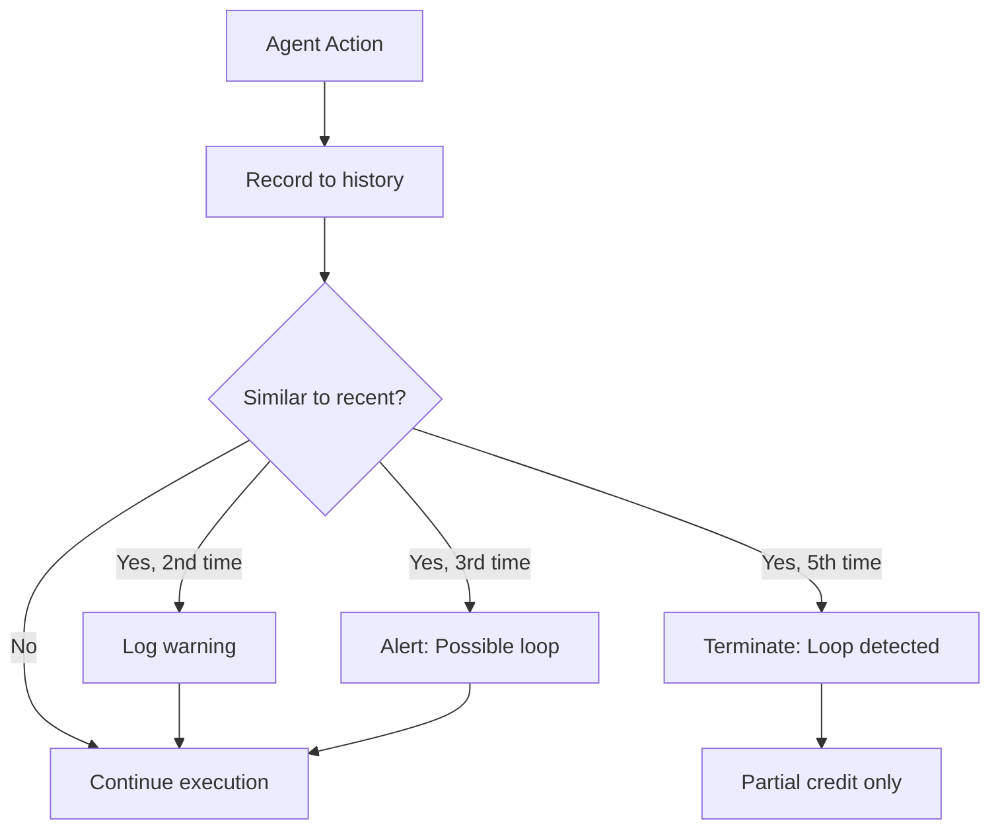
```mermaid
flowchart TD
    ACTION[Agent Action] --> RECORD[Record to history]
    RECORD --> CHECK{Similar to recent?}
    
    CHECK -->|No| CONTINUE[Continue execution]
    
    CHECK -->|Yes, 2nd time| WARN[Log warning]
    WARN --> CONTINUE
    
    CHECK -->|Yes, 3rd time| ALERT[Alert: Possible loop]
    ALERT --> CONTINUE
    
    CHECK -->|Yes, 5th time| STOP[Terminate: Loop detected]
    STOP --> PARTIAL[Partial credit only]
```

### Resource Guardrails

```mermaid
graph LR
    subgraph "Limits"
        L1[Max tool calls: 50]
        L2[Max tokens: 10,000]
        L3[Max time: 5 minutes]
        L4[Max retries per tool: 3]
    end
    
    subgraph "Enforcement"
        E1[Counter per limit]
        E2[Check before each action]
        E3[Graceful degradation]
    end
    
    L1 --> E1
    L2 --> E1
    L3 --> E1
    L4 --> E1
    
    E1 --> E2
    E2 --> E3
```

---

## 8. Grading Pipeline

### End-to-End Flow

```mermaid
flowchart TD
    SUBMIT[Candidate Submits Agent Code] --> SETUP[Environment Setup]
    
    subgraph SETUP[Environment Setup]
        S1[Create agent container]
        S2[Initialize simulated environment]
        S3[Load tool definitions]
        S4[Configure LLM proxy]
    end
    
    SETUP --> EXEC[Execution Phase]
    
    subgraph EXEC[Execution Phase]
        direction TB
        E1[Present task to agent]
        E2[Agent executes]
        E3[Record all actions]
        E4[Monitor resources]
        E5[Enforce limits]
    end
    
    EXEC --> EVAL[Evaluation Phase]
    
    subgraph EVAL[Evaluation Phase]
        V1[Check task completion]
        V2[Analyze action trajectory]
        V3[Assess reasoning quality]
        V4[Calculate efficiency]
        V5[Check for violations]
    end
    
    EVAL --> SCORE[Calculate Final Score]
    SCORE --> REPORT[Generate Report]
```

### Evaluation Harness

```mermaid
sequenceDiagram
    participant H as Harness
    participant A as Agent Container
    participant E as Environment
    participant L as LLM Proxy
    participant J as Judge LLM
    
    H->>E: Initialize environment
    H->>A: Send task
    
    loop Agent Execution
        A->>L: LLM call (reasoning)
        L-->>A: Response
        A->>E: Tool call
        E-->>A: Result
        E->>H: Log action
    end
    
    A-->>H: Final answer
    
    H->>E: Get final state
    H->>H: Compare to goal state
    
    H->>J: Evaluate reasoning quality
    J-->>H: Quality scores
    
    H->>H: Calculate composite score
    H->>H: Generate report
```

### Output Report Structure

```mermaid
graph TD
    subgraph "Report Sections"
        R1[Task Summary]
        R2[Action Trace]
        R3[Score Breakdown]
        R4[Feedback]
    end
    
    R1 --> D1[Goal, Final State, Completion %]
    R2 --> D2[Timestamped actions with reasoning]
    R3 --> D3[Per-dimension scores]
    R4 --> D4[Improvement suggestions]
```

---

## Appendix: Sample Test Case

```yaml
challenge: flight-booking-agent
version: 1.0

task:
  instruction: |
    Book the cheapest direct flight from New York (JFK) to Los Angeles (LAX)
    departing next Friday, returning the following Sunday.
    Use the user's saved payment method.
  
  success_criteria:
    - "Outbound flight booked for correct date"
    - "Return flight booked for correct date"
    - "Both flights are direct (no stops)"
    - "Total cost is minimal among options"
    - "Payment processed successfully"

environment:
  initial_state:
    user:
      id: "user_123"
      saved_payment: "card_ending_4242"
      preferences:
        seat: "window"
        class: "economy"
    
    available_flights:
      - id: "FL001"
        route: "JFK-LAX"
        date: "next_friday"
        price: 299
        stops: 0
      - id: "FL002"
        route: "JFK-LAX"
        date: "next_friday"
        price: 249
        stops: 0
      # ... more flights

tools:
  - name: search_flights
    parameters: [origin, destination, date, max_stops]
    
  - name: get_flight_details
    parameters: [flight_id]
    
  - name: book_flight
    parameters: [flight_id, passenger_id, payment_method]
    
  - name: get_user_info
    parameters: [user_id]

evaluation:
  max_tool_calls: 20
  max_tokens: 5000
  timeout_seconds: 180
  
  scoring:
    task_completion: 40
    reasoning_quality: 25
    efficiency: 20
    robustness: 15

optimal_solution:
  actions:
    - tool: get_user_info
      params: {user_id: "current"}
    - tool: search_flights
      params: {origin: "JFK", destination: "LAX", date: "next_friday", max_stops: 0}
    - tool: search_flights
      params: {origin: "LAX", destination: "JFK", date: "next_sunday", max_stops: 0}
    - tool: book_flight
      params: {flight_id: "FL002", ...}  # Cheapest outbound
    - tool: book_flight
      params: {flight_id: "FL007", ...}  # Cheapest return
  
  expected_tool_calls: 5
  expected_total_cost: 498
```

---

*Previous: [02-RAG-CHALLENGES.md](./02-RAG-CHALLENGES.md)*  
*Next: [04-PROMPT-ENGINEERING.md](./04-PROMPT-ENGINEERING.md) - Prompt Engineering Challenges*

