# Prompt Engineering Challenges

> **Evaluation Framework for Prompt Design and LLM Interaction Skills**

---

## Table of Contents

1. [Overview](#1-overview)
2. [Challenge Categories](#2-challenge-categories)
3. [Evaluation Criteria](#3-evaluation-criteria)
4. [Test Design Patterns](#4-test-design-patterns)
5. [Scoring Methodology](#5-scoring-methodology)
6. [Challenge Templates](#6-challenge-templates)
7. [Anti-Gaming Measures](#7-anti-gaming-measures)
8. [Grading Pipeline](#8-grading-pipeline)

---

## 1. Overview

### What is Prompt Engineering?

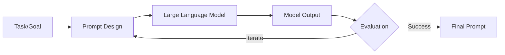

### Why Test Prompt Engineering?

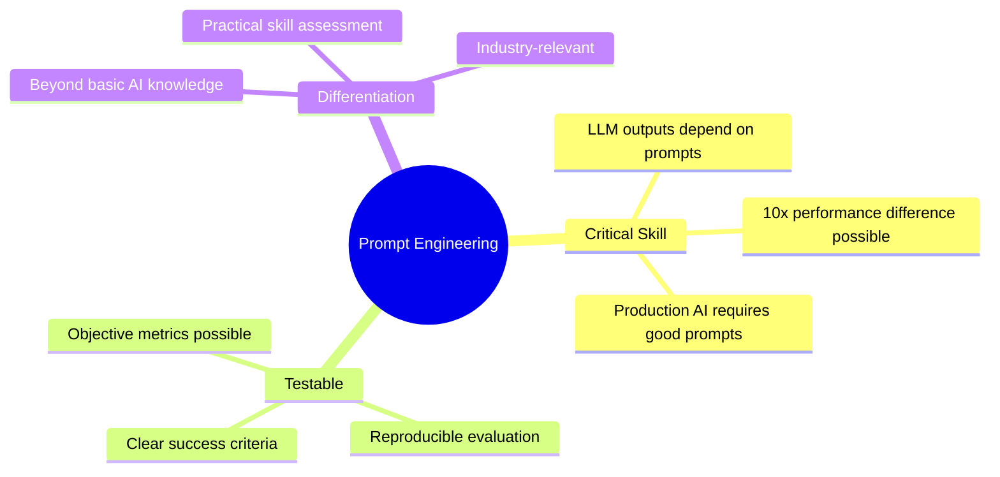

---

## 2. Challenge Categories

### Category Overview

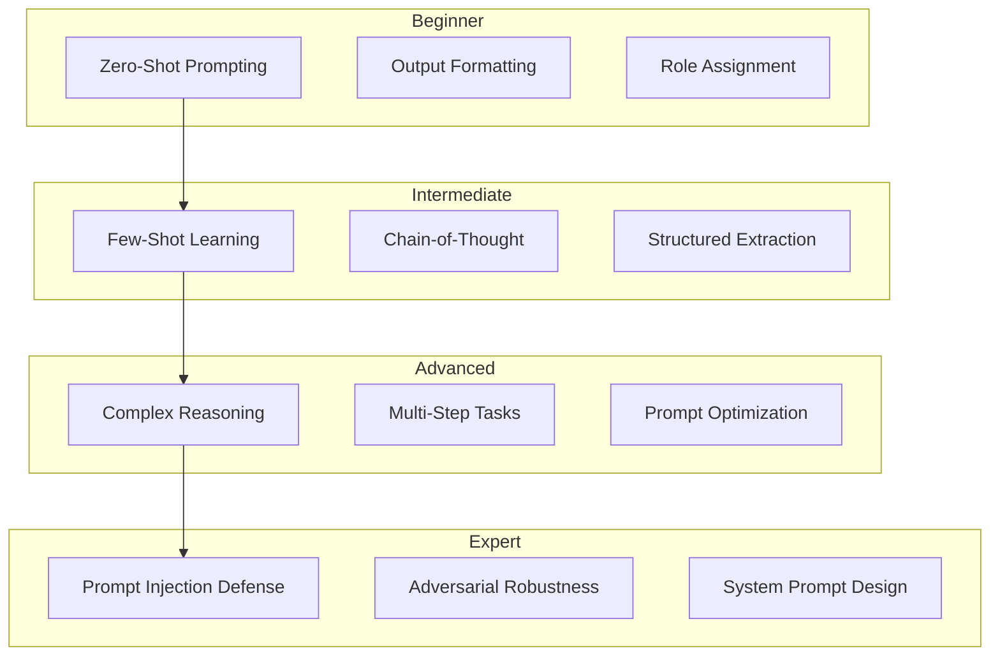

### Challenge Type Matrix

| Type | Description | Key Skill | Difficulty |
|------|-------------|-----------|------------|
| **Zero-Shot** | Single prompt, no examples | Clarity, instruction design | ⭐ |
| **Few-Shot** | Prompt with examples | Example selection, formatting | ⭐⭐ |
| **Chain-of-Thought** | Step-by-step reasoning | Reasoning scaffolding | ⭐⭐ |
| **Output Control** | Specific format required | Format specification | ⭐⭐ |
| **Extraction** | Pull structured data | Schema design | ⭐⭐⭐ |
| **Adversarial** | Handle edge cases | Robustness | ⭐⭐⭐ |
| **Injection Defense** | Prevent attacks | Security awareness | ⭐⭐⭐⭐ |
| **System Design** | Full prompt system | Architecture | ⭐⭐⭐⭐⭐ |

---

## 3. Evaluation Criteria

### Multi-Dimensional Assessment

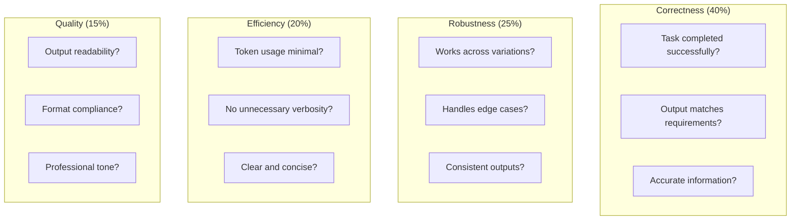

### Evaluation Signals

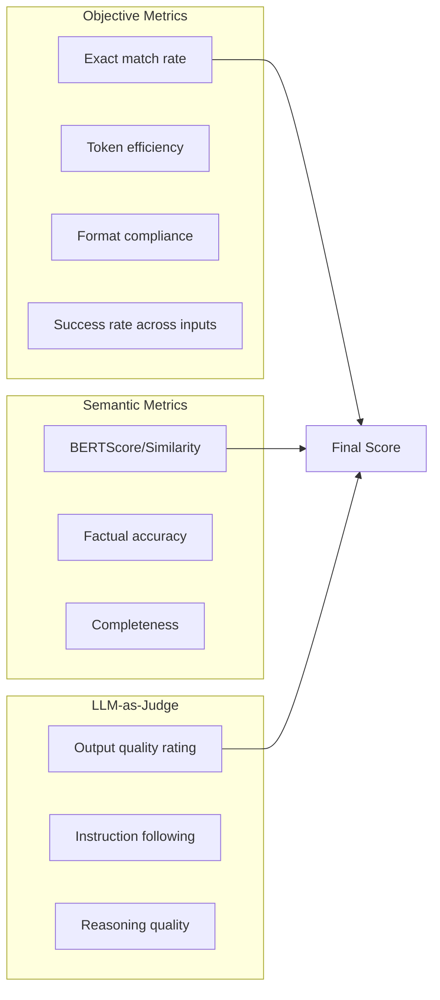

---

## 4. Test Design Patterns

### Pattern 1: Format Compliance

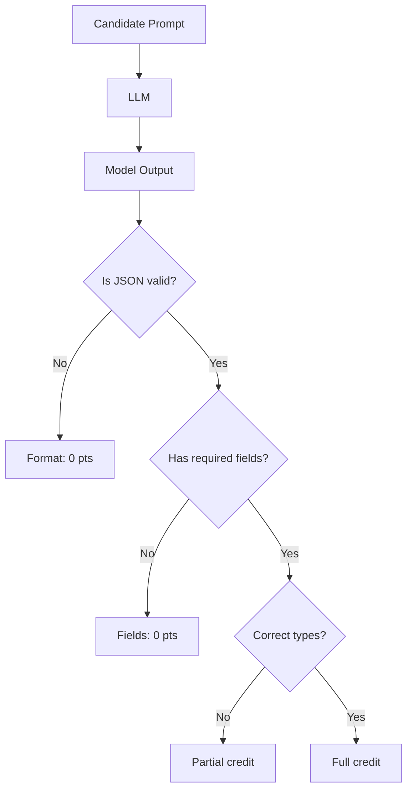

**Test Case Example:**
```yaml
task: "Extract product information as JSON"
input: "The iPhone 15 Pro costs $999 and has 256GB storage"
expected_format:
  type: "object"
  properties:
    name: {type: "string"}
    price: {type: "number"}
    storage: {type: "string"}
  required: ["name", "price", "storage"]

evaluation:
  - json_valid: 20%
  - schema_compliant: 30%
  - values_correct: 50%
```

### Pattern 2: Consistency Testing

```mermaid
sequenceDiagram
    participant E as Evaluator
    participant P as Candidate Prompt
    participant L as LLM
    
    Note over E,L: Same semantic input, different phrasing
    
    E->>P: Input variant 1: "Summarize this article"
    P->>L: [Prompt + Input]
    L-->>E: Output 1
    
    E->>P: Input variant 2: "Give me a summary of the text"
    P->>L: [Prompt + Input]
    L-->>E: Output 2
    
    E->>P: Input variant 3: "TL;DR this piece"
    P->>L: [Prompt + Input]
    L-->>E: Output 3
    
    E->>E: Compare outputs for consistency
    Note over E: Good prompt → Similar outputs<br/>Poor prompt → Varying outputs
```

### Pattern 3: Edge Case Handling

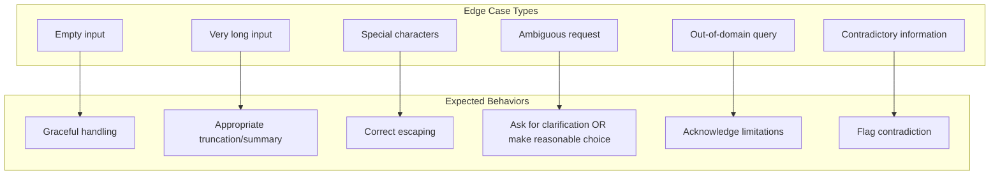

### Pattern 4: Adversarial Testing

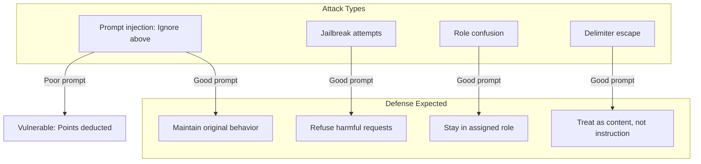

---

## 5. Scoring Methodology

### Per-Test-Case Scoring

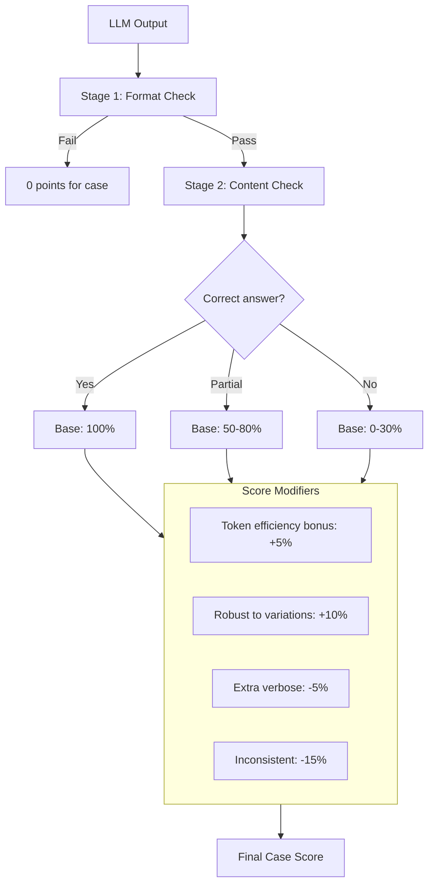

### Aggregate Scoring

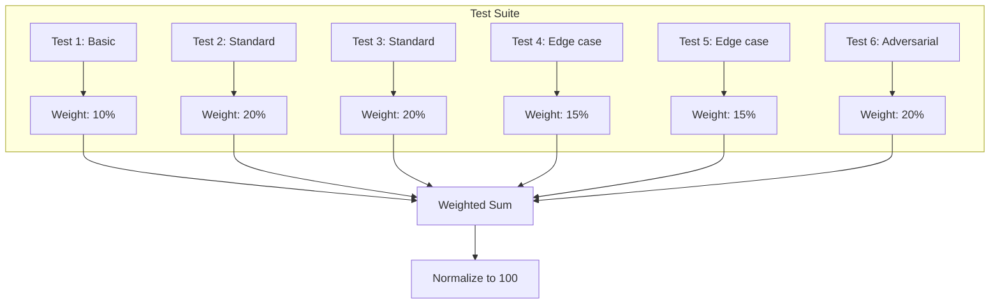

### Efficiency Scoring

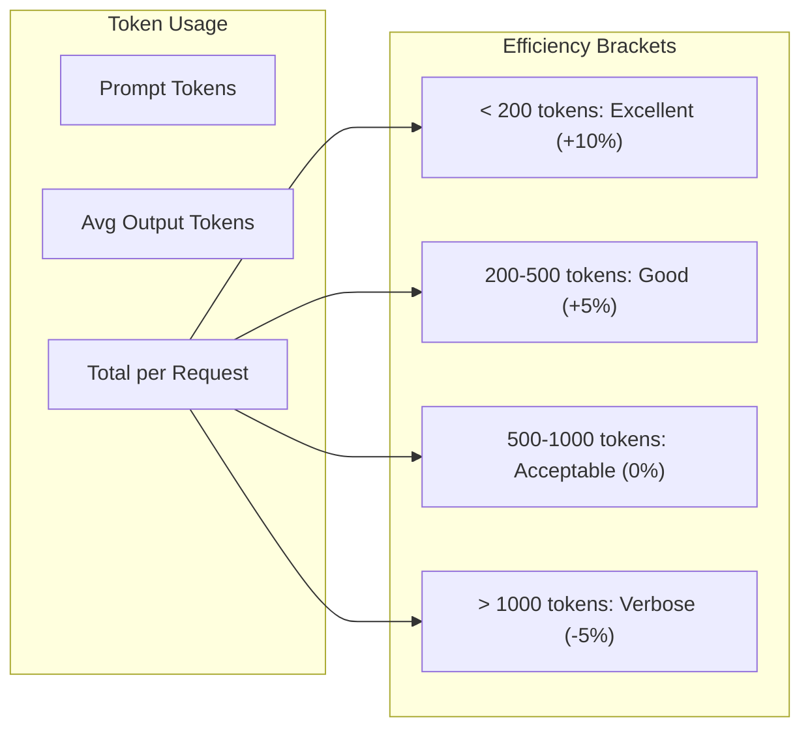

---

## 6. Challenge Templates

### Template 1: Classification Prompt

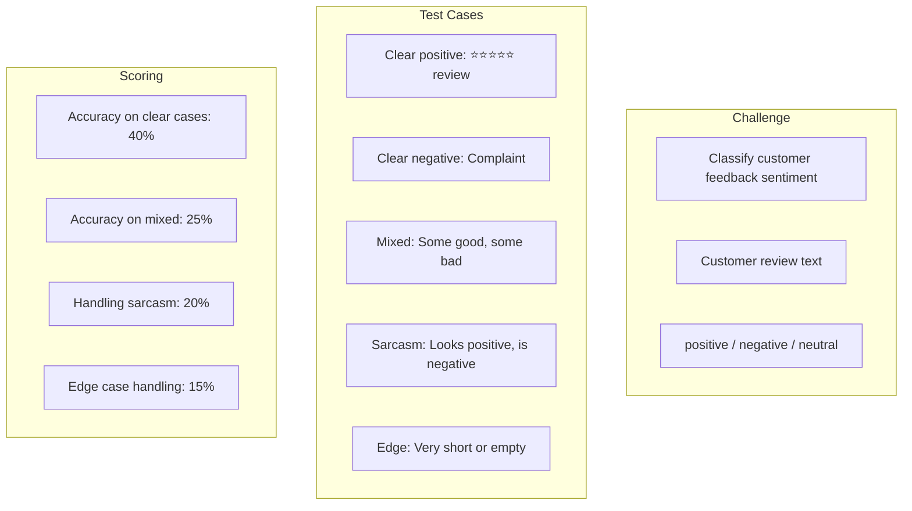

### Template 2: Information Extraction

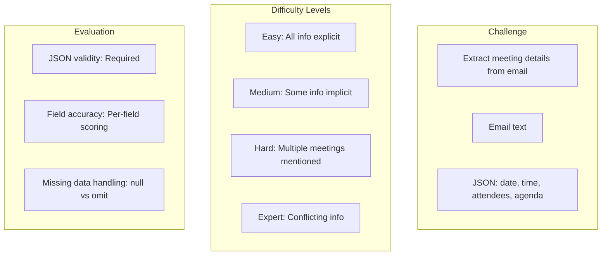

### Template 3: Chain-of-Thought Math

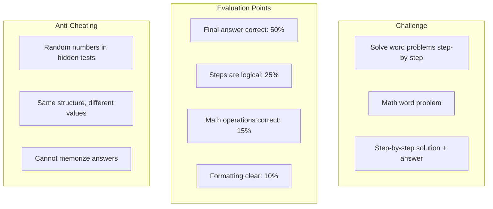

### Template 4: System Prompt Design

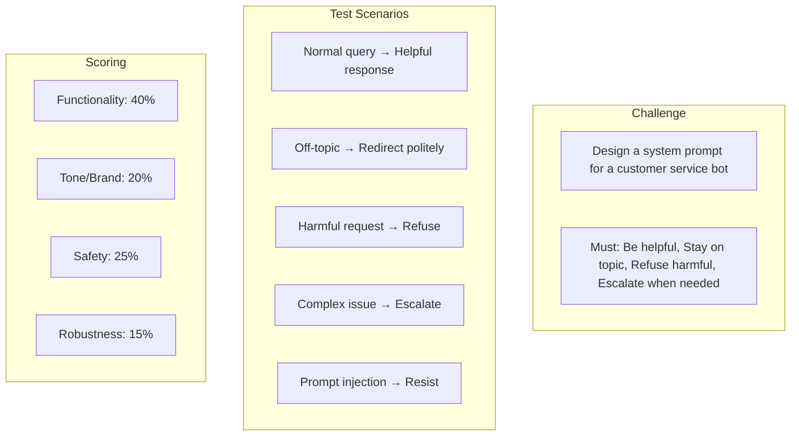

### Template 5: Few-Shot Learning

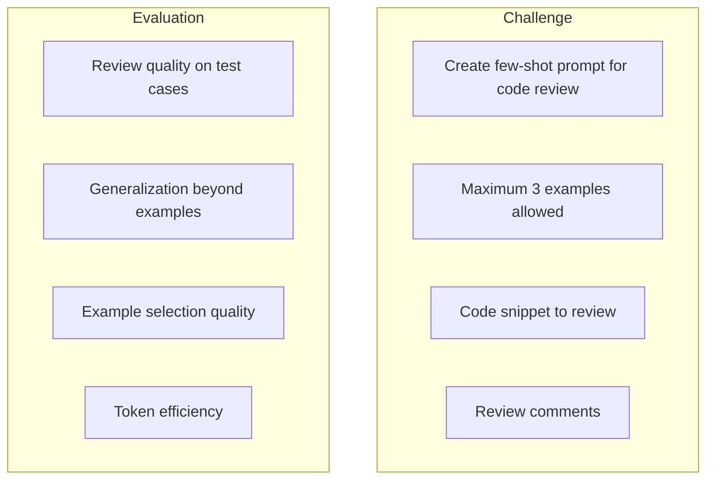

---

## 7. Anti-Gaming Measures

### Preventing Memorization

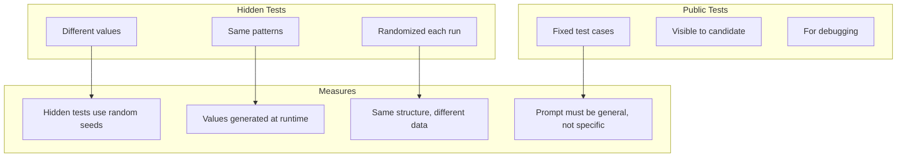

### Detecting Overfitting to Public Tests

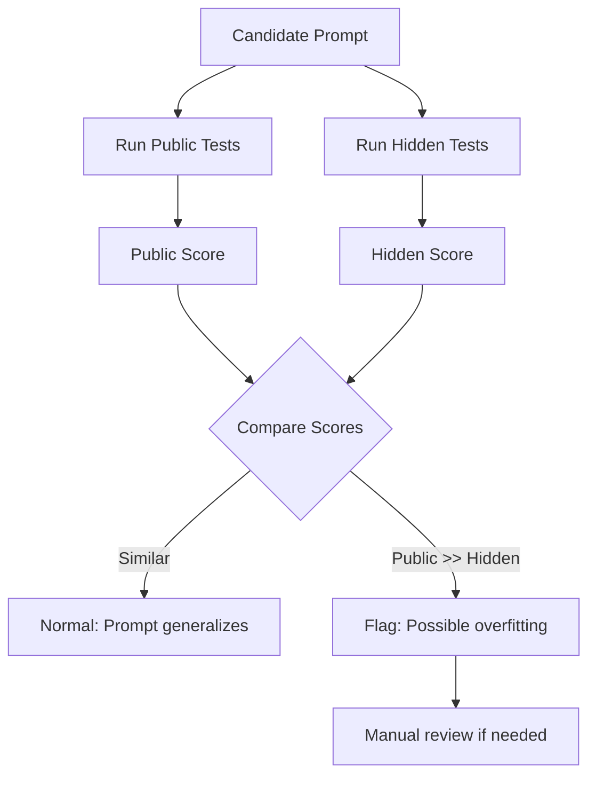

### Variation Testing

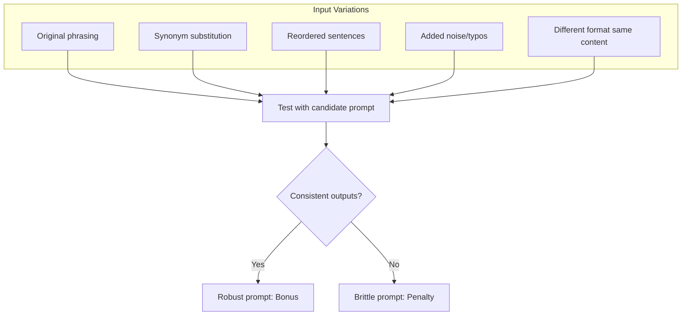

---

## 8. Grading Pipeline

### Execution Flow

```mermaid
flowchart TD
    SUBMIT[Candidate Submits Prompt] --> VALIDATE[Validate Prompt]
    
    VALIDATE --> VALID{Valid format?}
    VALID -->|No| REJECT[Reject submission]
    VALID -->|Yes| PREPARE[Prepare test inputs]
    
    PREPARE --> EXECUTE[Execute Tests]
    
    subgraph EXECUTE[Execute Tests]
        direction TB
        E1[Load test case]
        E2[Insert into prompt template]
        E3[Call LLM via proxy]
        E4[Capture output]
        E5[Record metrics]
    end
    
    EXECUTE --> EVALUATE[Evaluate Outputs]
    
    subgraph EVALUATE[Evaluate Outputs]
        V1[Format validation]
        V2[Content comparison]
        V3[Semantic similarity]
        V4[LLM-as-judge optional]
    end
    
    EVALUATE --> SCORE[Calculate Score]
    SCORE --> REPORT[Generate Report]
```

### LLM Calls Architecture

```mermaid
sequenceDiagram
    participant G as Grader
    participant P as LLM Proxy
    participant L as LLM
    
    G->>P: Configure quota for attempt
    P-->>G: Quota set
    
    loop For each test case
        G->>G: Format: candidate_prompt + test_input
        G->>P: POST /v1/chat/completions
        P->>L: Forward request
        L-->>P: Response
        P-->>G: Response + usage stats
        G->>G: Evaluate output
    end
    
    G->>P: Get total usage
    P-->>G: Token count
    
    G->>G: Factor usage into score
```

### Output Report

```mermaid
graph TD
    subgraph "Report Structure"
        R1[Overall Score]
        R2[Per-Category Breakdown]
        R3[Per-Test Details]
        R4[Token Usage Summary]
        R5[Improvement Suggestions]
    end
    
    R1 --> D1[85/100]
    R2 --> D2[Correctness: 38/40, Robustness: 20/25, ...]
    R3 --> D3[Test 1: Pass, Test 2: Partial, ...]
    R4 --> D4[Avg 342 tokens/request]
    R5 --> D5[Consider more specific output format...]
```

---

## Appendix: Sample Challenge Spec

```yaml
challenge:
  id: sentiment-classification-v1
  name: "Customer Feedback Classifier"
  difficulty: intermediate
  time_limit: 30_minutes
  
  description: |
    Design a prompt that classifies customer feedback into:
    - positive
    - negative  
    - neutral
    
    Your prompt will receive customer review text and must output
    ONLY the classification label (one word, lowercase).

  constraints:
    max_prompt_tokens: 500
    max_output_tokens: 10
    few_shot_examples_allowed: 3

  test_cases:
    public:
      - input: "This product is amazing! Best purchase ever!"
        expected: "positive"
      - input: "Terrible quality. Waste of money."
        expected: "negative"
      - input: "It's okay. Does what it's supposed to."
        expected: "neutral"
    
    hidden:
      - input: "Wow, just wow. NOT impressed at all."  # Sarcasm
        expected: "negative"
      - input: "I guess it works..."
        expected: "neutral"
      # ... more cases with random variations

  scoring:
    accuracy:
      weight: 0.5
      public_cases: 0.3
      hidden_cases: 0.7
    
    robustness:
      weight: 0.25
      variation_tests: 5
      
    efficiency:
      weight: 0.15
      optimal_tokens: 200
      
    consistency:
      weight: 0.10
      runs_per_case: 3

  evaluation:
    exact_match: true
    case_sensitive: false
    trim_whitespace: true
```

---

*Previous: [03-AI-AGENTS.md](./03-AI-AGENTS.md)*  
*Next: [05-TOKEN-MANAGEMENT.md](./05-TOKEN-MANAGEMENT.md) - Token Quota Management*

