# Token Quota Management

> **Resource Allocation and Cost Control for LLM-Based Challenges**

---

## Table of Contents

1. [Overview](#1-overview)
2. [Quota Architecture](#2-quota-architecture)
3. [Allocation Strategies](#3-allocation-strategies)
4. [Enforcement Mechanisms](#4-enforcement-mechanisms)
5. [Cost Tracking](#5-cost-tracking)
6. [Challenge Configuration](#6-challenge-configuration)
7. [Monitoring & Alerts](#7-monitoring--alerts)

---

## 1. Overview

### Why Token Management?

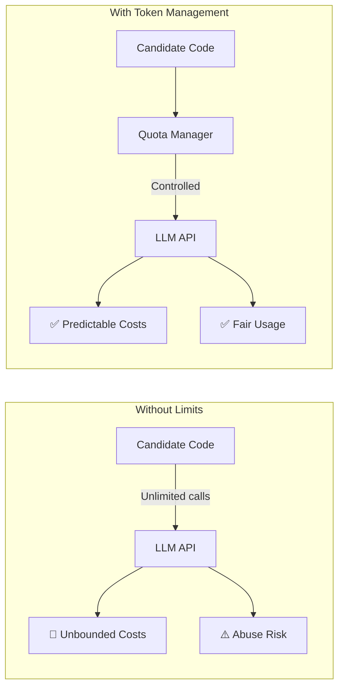

### Key Objectives

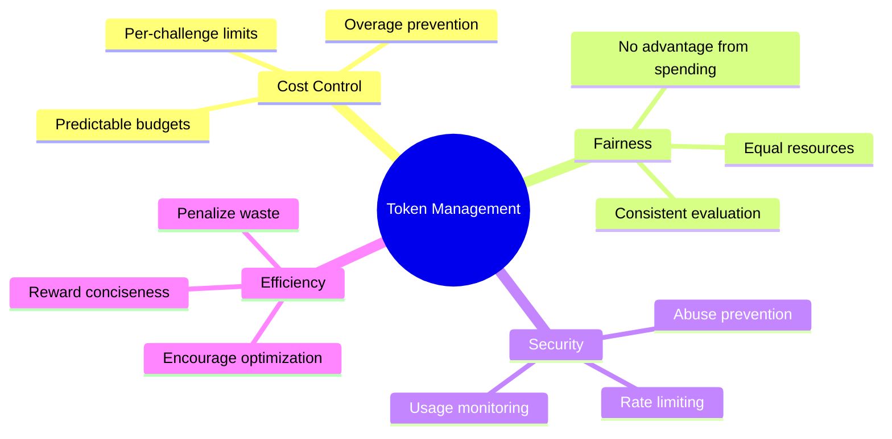

---

## 2. Quota Architecture

### System Components

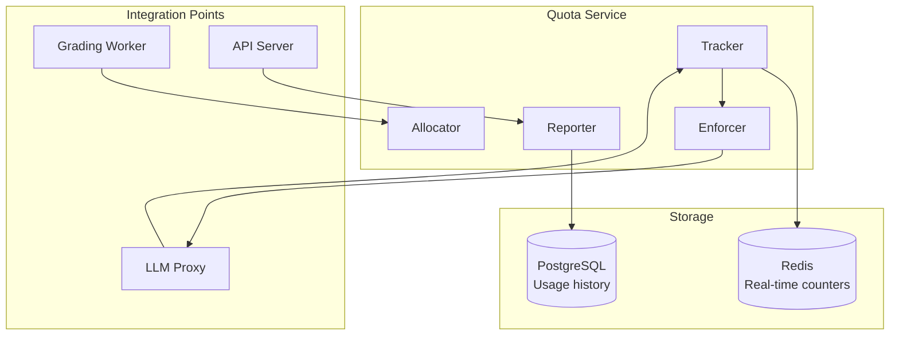

### Quota Hierarchy

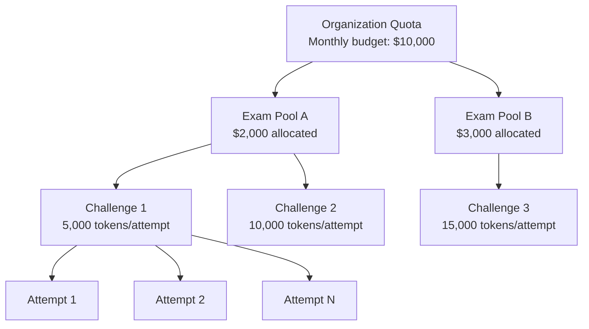

---

## 3. Allocation Strategies

### Token Budget Calculation

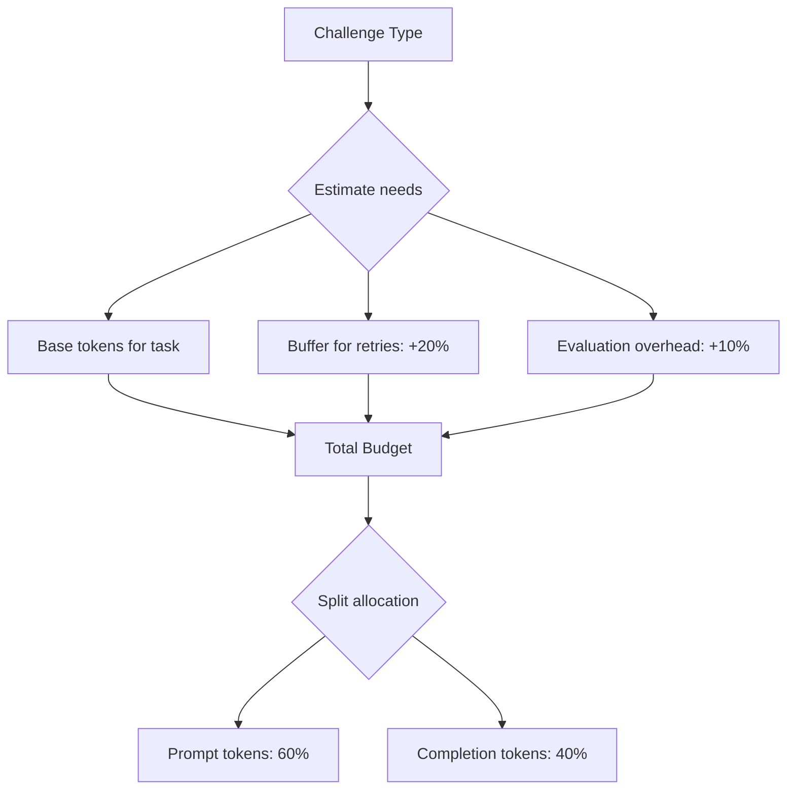

### Recommended Budgets by Challenge Type

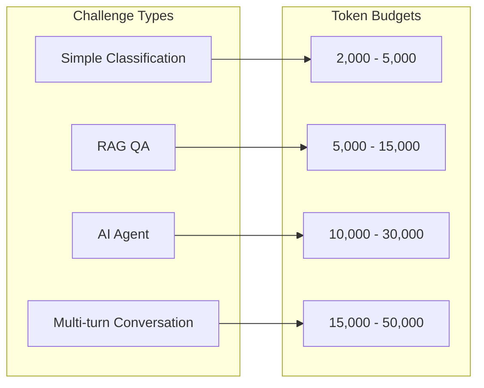

### Budget Breakdown Example

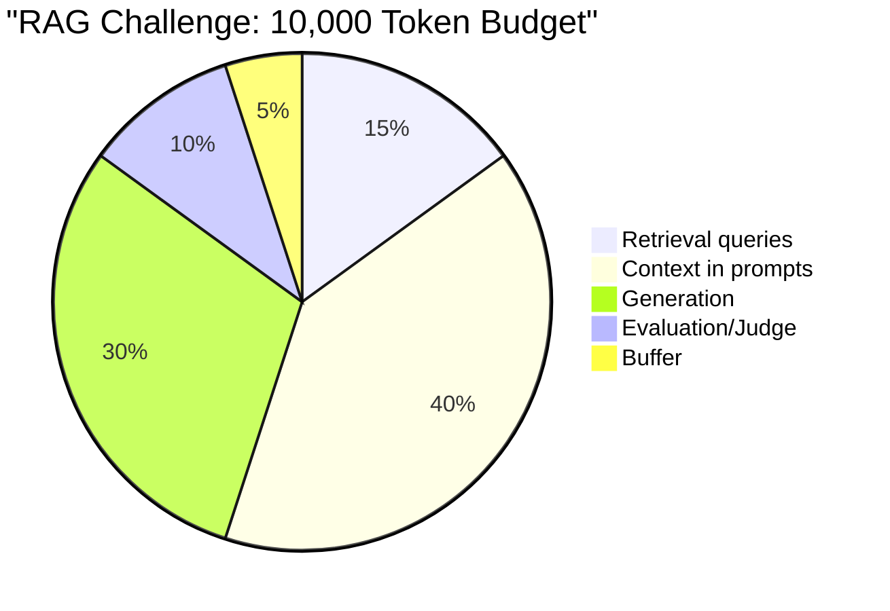

---

## 4. Enforcement Mechanisms

### Request Flow

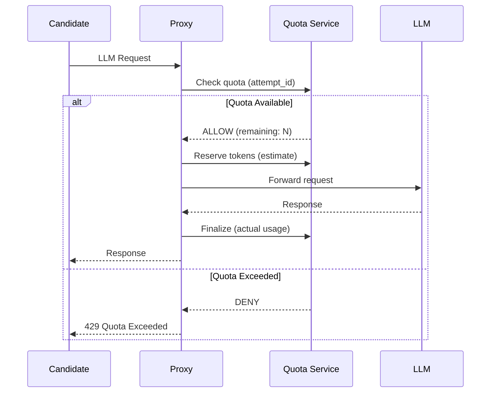

### Soft vs Hard Limits

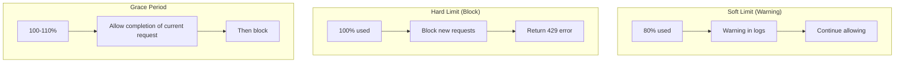

### Rate Limiting

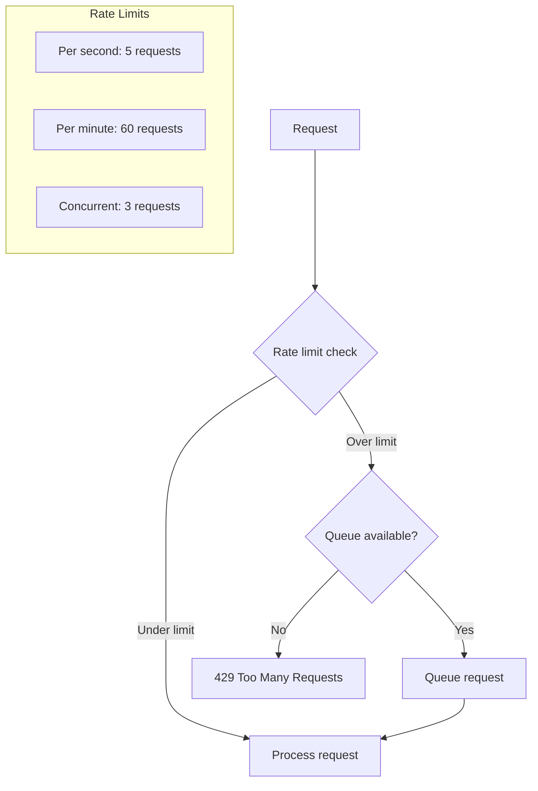

---

## 5. Cost Tracking

### Cost Calculation

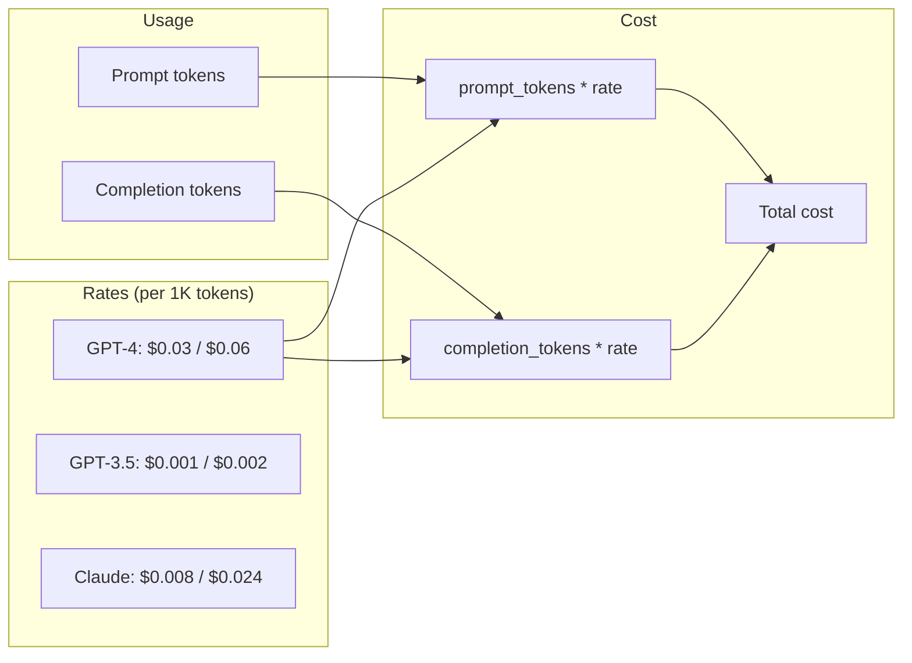

### Usage Attribution

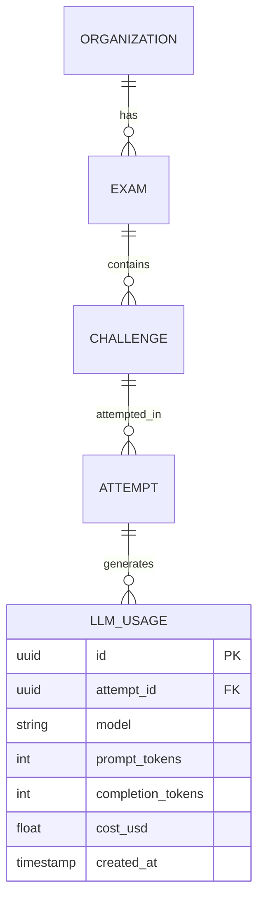

---

## 6. Challenge Configuration

### Configuration Schema

```yaml
challenge:
  id: rag-qa-v1
  name: "Document QA System"
  
  token_config:
    # Total budget for the attempt
    total_budget: 10000
    
    # Per-request limits
    max_prompt_tokens: 4000
    max_completion_tokens: 2000
    
    # Rate limits
    requests_per_minute: 30
    concurrent_requests: 2
    
    # Model restrictions
    allowed_models:
      - gpt-3.5-turbo
      - gpt-4
    default_model: gpt-3.5-turbo
    
    # Efficiency scoring
    efficiency_bonus:
      threshold: 5000  # If under this, bonus points
      bonus_percent: 10
    
    efficiency_penalty:
      threshold: 9000  # If over this, penalty
      penalty_percent: 5
```

### Model Tiering

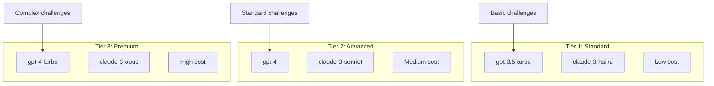

---

## 7. Monitoring & Alerts

### Real-time Dashboard

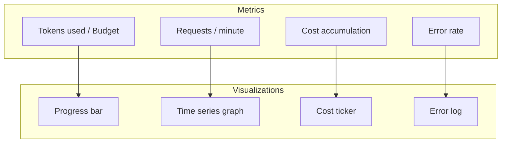

### Alert Thresholds

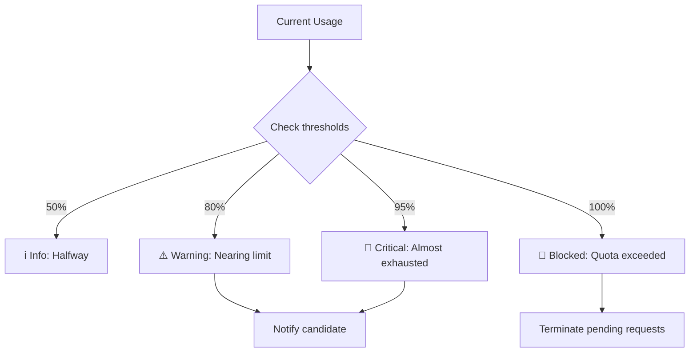

### Anomaly Detection

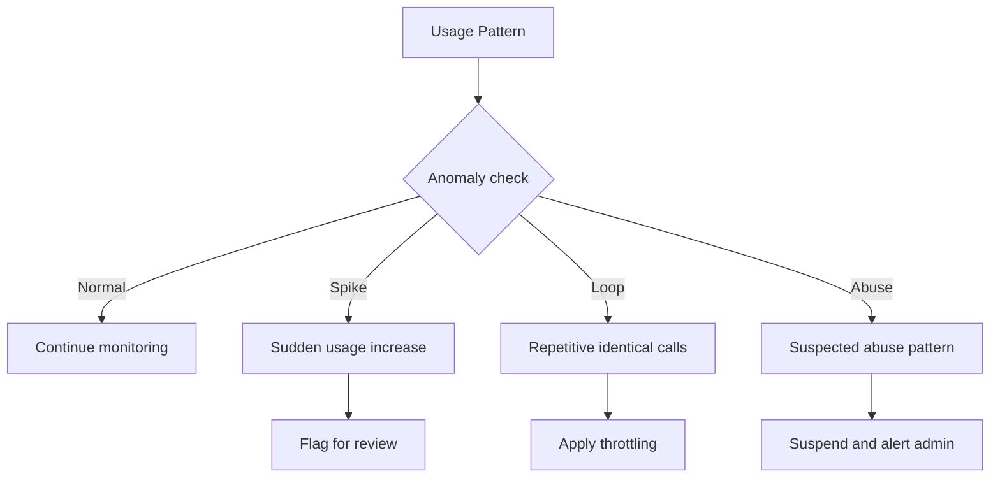

---

## Appendix: Error Messages

| Code | Message | Candidate Action |
|------|---------|------------------|
| `429` | "Token quota exceeded" | Optimize prompts, reduce calls |
| `429` | "Rate limit exceeded" | Add delays between requests |
| `400` | "Prompt too long" | Shorten prompt |
| `400` | "Model not allowed" | Use allowed model |

---

## Appendix: Sample Usage Report

```json
{
  "attempt_id": "uuid-xxx",
  "challenge_id": "rag-qa-v1",
  "token_budget": 10000,
  "usage_summary": {
    "total_tokens": 7823,
    "prompt_tokens": 5102,
    "completion_tokens": 2721,
    "requests": 12,
    "cache_hits": 3
  },
  "cost": {
    "model": "gpt-3.5-turbo",
    "prompt_cost": 0.0051,
    "completion_cost": 0.0054,
    "total_usd": 0.0105
  },
  "efficiency": {
    "tokens_per_request": 652,
    "under_budget_percent": 21.8,
    "efficiency_bonus_applied": true
  }
}
```

---

*Previous: [04-PROMPT-ENGINEERING.md](./04-PROMPT-ENGINEERING.md)*  
*Back to: [README.md](./README.md)*

