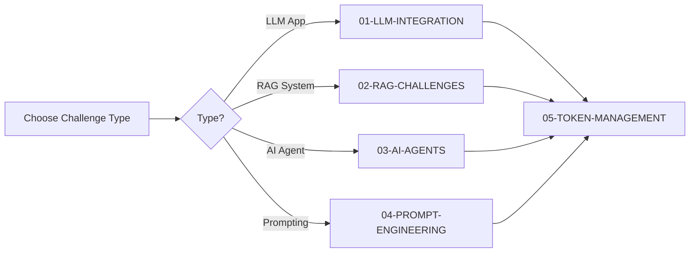
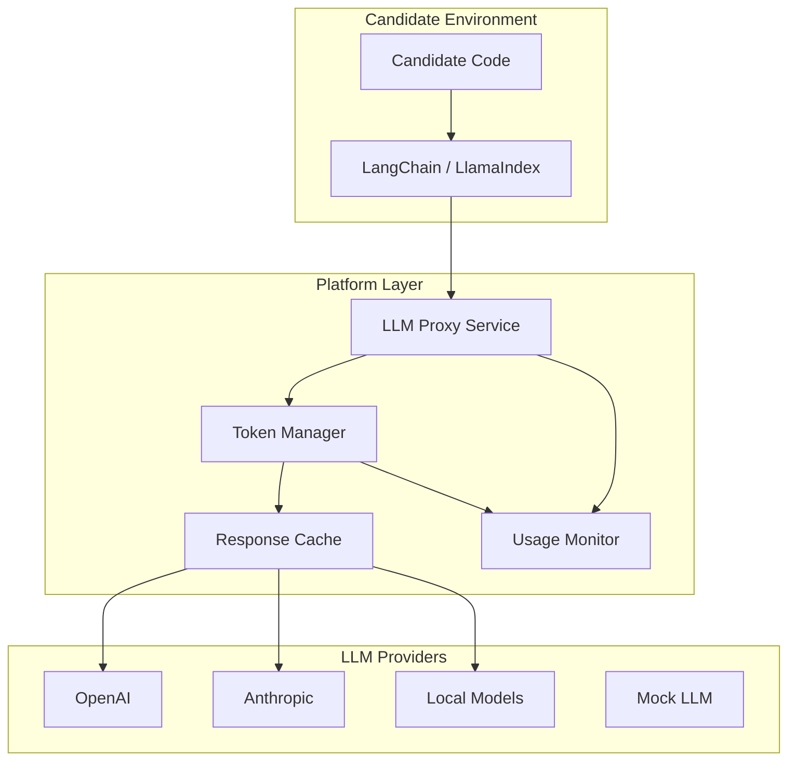
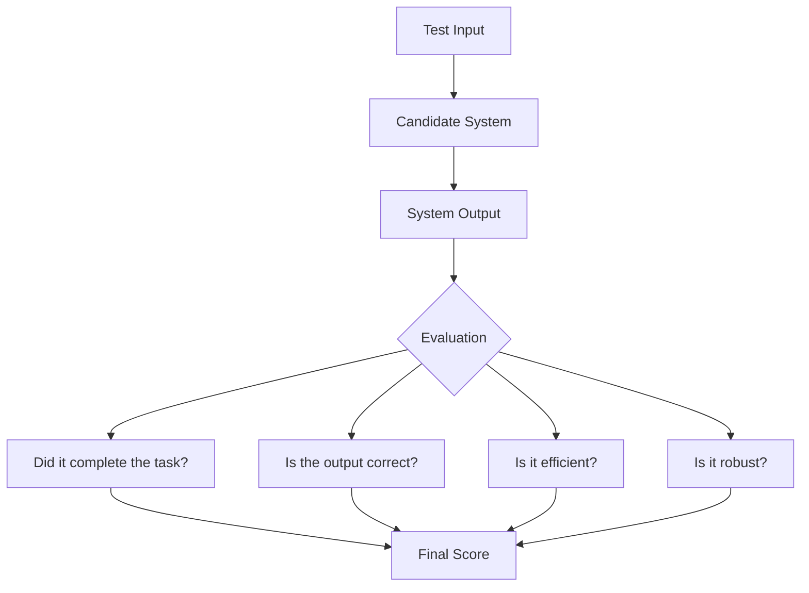
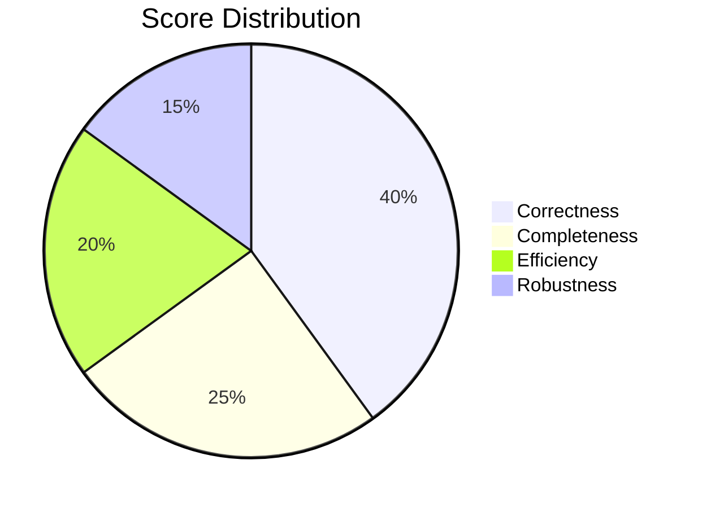
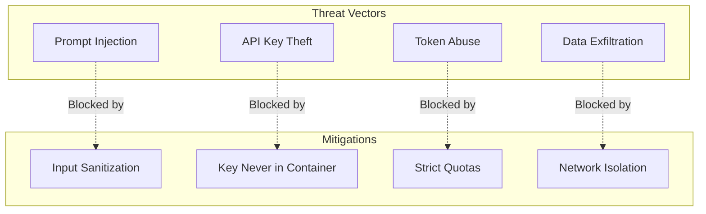

# Applied AI Challenge Framework

> **Documentation for LLM, RAG, AI Agents, and Prompt Engineering Challenges**

---

## Overview

This folder contains detailed specifications for implementing Applied AI challenges on the exam platform. These challenges evaluate candidates on their ability to work with modern AI systems including Large Language Models (LLMs), Retrieval-Augmented Generation (RAG), autonomous agents, and prompt engineering.

---

## Document Index

| Document | Description |
|----------|-------------|
| [01-LLM-INTEGRATION.md](./01-LLM-INTEGRATION.md) | Architecture for LLM API integration, proxy setup, and security |
| [02-RAG-CHALLENGES.md](./02-RAG-CHALLENGES.md) | RAG system evaluation, retrieval metrics, and test design |
| [03-AI-AGENTS.md](./03-AI-AGENTS.md) | Agent testing methodology, tool evaluation, and scoring |
| [04-PROMPT-ENGINEERING.md](./04-PROMPT-ENGINEERING.md) | Prompt challenge types, evaluation criteria, and examples |
| [05-TOKEN-MANAGEMENT.md](./05-TOKEN-MANAGEMENT.md) | Token quotas, cost tracking, and resource allocation |

---

## Quick Start

---

## Key Differences from Traditional ML Challenges

| Aspect | Traditional ML | Applied AI |
|--------|---------------|------------|
| **Model** | Candidate trains model | Uses pre-trained LLMs |
| **Evaluation** | Metric on predictions | Task completion + quality |
| **Resources** | GPU/Memory | API tokens |
| **Determinism** | Controllable | Stochastic (temperature) |
| **Cost** | Compute time | API costs |
| **Security** | Data isolation | Prompt injection defense |

---

## Architecture Overview

---

## Grading Philosophy

### 1. Task Completion Over Implementation

We evaluate **what** the system achieves, not **how** it's implemented internally.

### 2. Multi-Dimensional Scoring

### 3. Handling Non-Determinism

Since LLM outputs vary, we use:
- **Multiple evaluation runs** (3-5 per test case)
- **Semantic similarity** instead of exact match
- **Rubric-based scoring** for open-ended outputs
- **LLM-as-judge** for quality assessment

---

## Security Considerations

---

## Getting Started for Challenge Authors

1. **Read the relevant documentation** based on challenge type
2. **Design test cases** following the patterns in each doc
3. **Set token budgets** using the Token Management guide
4. **Write evaluation scripts** using provided templates
5. **Test locally** with mock LLM before production

---

*Last Updated: January 5, 2026*

